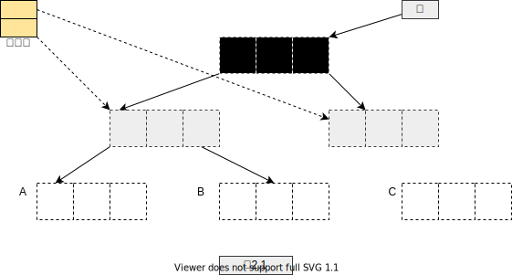

# 第二章 标记-清扫回收

关键字：

- 三色抽象
- 标记-清扫算法
- 位图标记
- 空间大小分级 size class
- 位图
- 字节图 byte-map
- 换页次数
- 惰性清扫
- 非移动式回收算法

标记-清扫(mark-sweep)、标记-复制(mark-copy)、 标记-整理(mark-compact)、引用计数(reference counting)是 4 种最基本的垃圾回收策略。
大多数回收器可能会以不同的方式对这些基本回收策略进行组合，例如在堆中某一区域使用一种回收策略，而在另一个区域使用另一种回收策略。

在对这 4 种基本回收策略进行描述时，我们假设赋值器运行在一个或者多个线程之上，
且**只有一个回收器线程**，当回收器线程运行时，所有的**赋值器线程**均处于停止状态。这种
“万物静止”(stop the world)的策略大幅简化了回收器的实现。

从赋值器线程角度来看，回收过程的执行是原子性的，即赋值器线程感知不到回收器的任何中间状态，
回收器也不会受到赋值器线程的任何干扰。我们假设当回收过程开始时，赋值器线程停止在一个允许回收器
安全扫描其根集合的回收点，具体的运行时接口我们将在第 11 章详述。

通过“万物静止”的方法可以获取**堆的快照**，因此回收器在进行对象存活性判定时不用担心赋值器将堆中对象
的拓扑结构重新排列。这同时也意味着在回收器释放内存的过程中，我们无需担心在同一时
刻存在其他回收器释放内存或者赋值器线程申请内存，进而避免在线程之间引人额外的同步
机制。多赋值器线程同时获取内存的情况我们将在第 7 章讨论，多回收器线程，或者赋值器
与回收器并发执行的情况将导致运行时系统更加复杂，我们将在后面的章节中进行讨论。

理想的垃圾回收的目的是回收程序不再使用的对象所占用的空间，任何自动内存管理系
统都面临 3 个任务:

- 1)为新对象分配空间。
- 2)确定存活对象。
- 3)回收死亡对象所占用的空间。

这些任务并非相互独立，特别是回收空间的方法影响着分配新空间的方法。正如第 1 章
所提到的，真正的存活性问题是一个不可确定的问题，因此我们使用指针可达性(参见 1.6
节)来近似对象的存活性:只有当堆中存在一条从根出发的指针链能最终到达某个对象时，
才能认定该对象存活，更进一步，如果不存在这样一条指针链，则认为对象死亡，其空间可
以得到回收。尽管存活对象集合中可能包含一些永远不会再被赋值器访问的对象，但是死亡
对象集合中的对象却必定是死亡的。

标记-清扫算法[McCarthy,1960]是我们将要介绍的第一种回收算法，它是在指针
可达性递归定义指导下最直接的回收方案。

它的回收过程分为两个阶段:

第一阶段为追踪(trace)阶段，即回收器从根集合(寄存器、线程栈、全局变量)开始遍历对象图，并标记(mark)所遇到的每个对象;
第二阶段为清扫(sweep) 阶段，即回收器检查堆中每一个对象，并将所有`未标记`的对象当作垃圾进行回收。

标记-清扫算法是一种`间接回收`(indirect collection)算法，它并非直接检测垃圾本身，
而是先确定所有存活对象，然后反过来判定其他对象都是垃圾。需要注意的是，该算法的每
次调用都需要重新计算存活对象集合，但并非所有的垃圾回收算法都需要如此。第 5 章将介
绍一种`直接回收`(direct collection) 策略，即引用计数。与间接回收不同，直接回收可以通
过对象本身来判断其存活性，因此其不需要额外的追踪过程。

## 标记-清扫算法

从垃圾回收器角度来看，赋值器线程所执行的只有 3 种操作:`创建`、`读`、`写`。每一个回
收算法必须对这 3 种操作进行合理的重定义(1.6 节给出了默认的定义)。标记-清扫算法
与赋值器之间的接口十分简单:如果线程无法分配对象，则唤起回收器，然后再次尝试分配
(如算法 2.1 所示)。为了强调回收器工作在“万物静止”模式下而非与赋值器线程并发执行，
我们特别使用 `atomic` 关键字来标记回收程序。如果回收完成之后仍然没有足够的内存以满
足分配需求，则说明堆内存耗尽。

```c
// 算法 2.1 标记-清扫：分配
New():
    ref <- allocate()
    if ref = null /*堆中无可用空间*/
        collect()
        ref <- allocate()
    if ref= null
        /*堆中仍然无可用空间*/
        error "Out of memory"
    return ref

atomic collect():
    markF romRoots( )
    sweep(HeapStart, HeapEnd)
```

```c
// 算法 2.2 标记-清扫: 标记
markFromRoots():
    initialise(worklist)
    for each fld in Roots
        ref <- *fld
        if ref != null & not isMarked(ref)
            setMarked(ref)
            add(worklist, ref)
            mark()

initialise(worklist):
    worklist < - empty

mark():
    while not isEmpty(worklist)
        ref <- remove(worklist)  /* ref已经标记过*/
        for each fld in Pointers(ref)
        child t <- *fld
        if child != null && not isMarked(child)
            setMarked(child)
            add(worklist, child)
```

```c
// 算法 2.3 标记-清扫:清扫
sweep(start, end):
scan <- start
while scan < end
    if isMarked( scan)
        unsetMarked(scan)
    else free(scan)
        scan <- nextObject(scan)
```

我们将在第 7 章之后讨论 allocate 和 free 的具体实现细节，但需要注意的是，标记-清
扫回收器要求堆布局满足一定的条件:第一，标记-清扫回收器不会移动对象，因此内存管理
器必须能够控制堆内存碎片，这是因为过多的内存碎片可能会导致分配器无法满足新分配请
求，从而增加垃圾回收频率，在更坏情况下，新对象的分配可能根本无法完成;第二，清扫
器必须能够遍历堆中每一个对象，即对于给定对象，不管其后是否存在一些用于对齐的填充
字节，sweep 方法都必须能够找到下一一个对象，因此用 nextobject 方法要完成堆的遍历，仅获
取对象的大小信息是远远不够的(算法 2.3 中的第 7 行)。我们将在第 7 章讨论堆的可遍历性。

## 三色抽象

三色抽象(tricolour abstraction) [Dijkstra 等，1976， 1978] 可以简洁地描述回收过程中对象状态的变化(是否已被标记、是否在工作列表中等)。
三色抽象是描述追踪式回收器的一种十分有用的方法，利用它可以推演回收器的正确性，这正是回收器必须保证的。在三色抽象中，
回收器将对象图划分为黑色对象(确定存活)和白色对象(可能死亡)。任意对象在初始状态下均为白色，当回收器初次扫描到某一对象时将其着为灰色，
当完成该对象的扫描并找到其所有子节点之后，回收器会将其着为黑色。

从概念上讲，黑色意味着已经被回收器处理过，灰色意味着已经被回收器遍历但尚未完成处理(或者需要再次进行处理)。
三色抽象也可以推广到对象的域中:灰色表示正在处理的域，黑色表示已经处理过的域。如果把赋值器也当作一个对象，
则三色抽象也可用于推演赋值器根集合的状态变化[Pirinen，1998] :灰色赋值器表示回收器尚未完成对其根集合的扫描，黑色赋值器表示回收器已经完成对其根集合的扫描(并且不需要再次扫描)。
一次堆遍历过程可以形象地看作是回收器以灰色对象作为“波面”(wavefront),将黑色对象和白色对象分离，不断向前推进波面，直到所有可达对象都变成黑色的过程。




图 2.1 使用三色抽象来演示标记过程。黑色表示回收器已经将该对象及其后代处理完成，灰色表示回收器已
经扫描到对象但尚未完成处理，白色表示回收器尚未扫描到对象(某些对象可能永远无法扫描到)

上述算法中存在一个重要的不变式:在标记过程完成后，对象图中将不可能存在从黑色对象指向白色对象的引用，因此在标记过程中，
所有白色可达对象都只能是从灰色对象可达。如果这一不变式被打破，那么回收器将不会进一步处理黑色对象，从而可能导致某个黑
色对象的后代可达但未被标记(进而被错误地释放)。后面我们将看到，在研究赋值器线程与回收器线程并发执行的并发垃圾回收时，垃圾回收状态的三色视图将十分有用。

## 懒惰清扫

接下来我们考虑如何降低甚至消除清扫阶段赋值器的停顿时间。通过观察可以发现，对
象及其标记位存在两个特征:第一一旦某个对象成为垃圾，它将一直都是垃圾， 不可能再
次被赋值器访问或者复活;第二，赋值器永远不会访问对象的标记位。因此在赋值器工作的
同时，清扫器可以并行修改标记位，甚至修改垃圾对象的域，并将其链接到分配结构体中。
我们同样也可以使用多个清扫器线程与赋值器并发工作，但更加简单的方案是使用懒惰清扫
(lazy sweeping) [Hughes, 1982] 策略。该方案利用分配器来扮演清扫器的角色，即把寻找
可用空间的任务转移到allocate过程中，从而不再需要单独的清扫阶段。最简单的清扫策
略是，allocate简单地向前移动清扫指针，直到在连续的未标记对象中找到一块足够大的空间，
但一次清扫包含多个对象的内存块更具有实用性。

## size class

算法 2.5 演示了使用懒惰清扫策略处理整个内存块的方法。分配器通常只会在一个内存
块中分配相同大小的对象(在第 7 章中详述),每种`空间大小分级`(size class)都会对应一个
或多个用于分配的内存块，以及一个待回收内存块链表(reclaim list of blocks)。在回收过程

- 赋值器开销
- 吞度量
- 空间利用率

## 吞吐量

使用懒惰清扫策略的标记-清扫回收器通常具有较高的吞吐量。标记阶段的开销相对较
小，且其主要取决于指针追踪的开销。对于已发现的存活对象，标记-清扫回收器通常只需
要简单地设置一个标记位或者标记字节，而半区复制式回收器(参见第4章)和标记-整理
回收器(参见第3章)则必须复制或者移动整个对象。与其他追踪式回收器类似，标记-清
扫回收器在执行过程中需要挂起所有赋值器线程，回收停顿时间取决于应用程序的运行及其
输入。对于大型系统而言，回收停顿时间极有可能达到数秒甚至更长。

## 空间利用率

与基于半区复制的回收策略相比，标记-清扫回收显然具有较高的空间利用率。同时与引用计数算法相比，标记-清扫回收的空间利用率仍然较高。
将标记位放在对象头部基本不会产生额外的空间开销，而如果使用位图来保存标记位，则额外空间开销的大小取决于对象的字节对齐要求，
但其总大小不会超过堆的字节对齐要求的倒数(即堆空间的1/32或1/64，具体的值取决于堆的组织架构)。相比之下，
引用计数算法则需要占用对象头部-一个完整槽来记录引用计数(尽管可以通过限制引用计数最大值的方法来减少所需的空间)，复制式回收器必须将可用堆划分为两个大小相等的半区，
且在任意时间里只有一个半区可用，因而内存空间利用率更低。但在另-方面，非整理式回收器(如标记-清扫回收以及引用计数)通常需要依赖更加复杂的分配器(如分区适应空闲链表分配)，
这通常会给回收器带来不可忽视的开销。

同时，非整理式回收器通常都会存在内存碎片，这也会对空间利用率造成一定影响。和其他的追踪式回收算法-样，标记-清扫算法在回收所有死亡对象的空间之前必须先确定空间中所有的存活对象。
这是一项昂贵的操作，并且应当偶尔执行。这也意味着追踪式回收器必须在堆中保留一定的空间来执行这项操作。如果存活对象在堆中的比例过大，且内存分配速度较快，
那么标记-清扫回收器将会频繁执行回收，从而引发序性能上的颠簸。对于中到大型的堆，可能需要在堆中保留20% ~50%的空间[Jones， 1996]， 而Herts和Berger[2005]发现，
使用标记-清扫回收的Java程序如果要达到与显式释放相同的吞吐率，需要比后者多使用数倍的堆空间。

## 非移动式回收算法

非移动式回收算法的主要问题在于，在长期运行的应用程序中堆可能会逐渐碎片化。