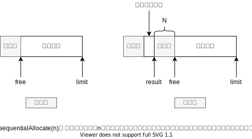

# 第七章 内存分配

关键字：

- 顺序分配 (sequential allocation)
- 空闲链表分配 (free-list allocation)
- 多空闲链表分配 (multiple free-list)
- 首次适应分配
- 循环首次适应分配
- 最佳适应分配
- 空闲链表分配的加速
- 分区适用分配
- 空间大小分级(size class)

内存管理器需要处理的问题包括 3 个方面:

- ① 如何分配内存;
- ② 如何确定存活数据;
- ③ 如何回收死亡对象所占用的空间;

以便在程序的后续执行过程中重新将其分配出去。对于这了个问题，`垃圾回收系统`和`显式内存管理器`有着不同的处理策略，
且不同回收器所使用的算法也各不相同。但不论如何，内存的分配和回收过程都是紧密相关的，
使用任何一种分配策略都必须要考虑如何回收其所分配的内存。

本章将首先介绍两种基本的分配策略:`顺序分配`(`sequential allocation`)与`空闲链表`分配
(`free-list allocation`)， 紧接着是基于`多空闲链表`(`multiple free-list`) 的更加复杂的分配。
然后将介绍其他--些实用的注意事项。本章最后将对选择分配策略时需要考虑的因素进行总结。

## 顺序分配

顺序分配使用一个较大的空闲内存块。对于 n 字节的内存分配请求，顺序分配将从空闲
块的一端开始进行分配，其所需的数据结构十分简单，只需要一个空闲指针(`free pointer`)
和一个界限指针(`limit pointer`)。算法 7.1 展示了顺序分配的伪代码，其内存分配方向是从
低地址到高地址，图 7.1 对其分配过程进行了描述。由于顺序分配策略总是简单地移动空闲
指针，所以俗称为阶跃指针分配(`bump pointer allocation`)。在某些场景下，顺序分配也被
称为线性分配(`linear allocation`)，因为对于指定内存块而言，其所分配地址的顺序总是线性
的。关于分配过程中的字节对齐以及填充(`padding`)要求，参见 7.6 节和 7.8 节。顺序分配
的特征如下:

- 简单。
- 高效(尽管 Blackburn 等[2004]指出，对于 Java 系统而言，顺序分配和分区适应空闲链表分配(见 7.4 节)之间的性能差距不超过 1%的整体执行时间)。
- 相对于空闲链表分配，顺序分配可以给赋值器带来更好的高速缓存局部性，特别是对于移动式回收器中对象的初次分配。
- 与空闲链表分配相比，顺序分配不适用于非移动式回收器。如果未被回收的对象将较
  大的空闲内存块分割成许多较小的内存块，则空闲内存将会呈现出碎片化趋势，即可
  用空间散布在众多可以用于顺序分配的小内存块中，而不是少数几个大内存块里。

> 图 7.1



```java
// 算法 7.1 顺序分配
sequentialAllocate(n):
    result ← free
    newFree ← result+ n
    if newFree> l imit
        return null /*内存耗尽*/
    free ← newFree
    return result
```

## 空闲链表分配

空闲链表分配是与顺序分配截然不同的一种内存分配策略，它使用某种数据结构来记录
空闲内存单元( free cell) 的位置和大小，该数据结构即空闲内存单元的集合。严格意义上
讲，空闲内存单元的组织方式`并非一定是链表`，也可以采用其他形式，但尽管如此，我们仍
使用`空闲链表`这一传统名称。我们可以将顺序分配看作是空闲链表分配退化后的一种特
例，但在实际应用中，顺序分配的性质更加特殊，且实现更为简单。

我们将首先考虑以单链表方式组织空闲内存单元的策略，即在需要内存分配时，分配器
顺序检测每个空闲内存单元，依照某种策略选择-个并从中进行分配。其算法实现通常是顺
序扫描所有空闲内存单元，直到发现第一个符合条件的内存单元为止，因而被称为`顺序适应分配`(sequential-fits allocation)。
典型的顺序适应策略包括首次适应(first-fit)、 循环首次适应曰(next-fit)、 最佳适应(best-fit) [Knuth, 1973， 2.5 节],我们将逐一.进行描述。

### 首次适应分配

对于一次内存分配请求，首次适应分配器将在所发现的第一个满足分配要求的内存单元
中进行分配。如果该内存单元的空间大于所需的分配空间，则分配器将`分裂(split)该内存
单元，并将剩余空间归还到空闲链表中。然而，如果分裂后的剩余空间太小以至于无法再用
于分配(分配算法及数据结构通常限制了最小可分配内存单元的大小)，则分配器会避免分
裂。另外，如果分裂后的剩余空间小于某一固定阈值或者某一百分比，分配器也可避免分裂。
算法 7.2 给出了首次适应分配的代码。需要注意的是，该算法假定每个空闲内存单元内
部都记录了自身大小以及下一个空闲内存单元的地址，因此只需要一个全局变量 head 来记录链表中第一个空闲内存单元的地址。

算法 7.3 是首次适应分配的一个变种，即当节点分裂之后将后半个内存单元分配出去，
从而简化了代码实现。该方案可能的不足之处在于其对象对齐方式有所不同，但无论如何这
也是分割内存单元的一种方式。首次适应分配的特征如下[Wilson 等，1995a, 第 31 页]:

- 较小的空闲内存单元会在靠近链表头的位置聚集，从而导致分配速度变慢。
- 在空间使用率方面，在首次适应分配算法的空闲链表中，内存单元会大致以从小到
  大的顺序排列，因此其行为模式与最佳适应分配比较相似。

```java
// 算法 7.2 首次适应分配
firstFitAllocate(n):
  prev ← addressOf(head)
  loop
    curr ← next(prev)
    if curr = null
      return null   /*内存耗尽*/
    else if size(curr) < n
      prev ← curr
    else
      return listAllocate(prev, curr, n)

listAllocate(prev, curr, n):
  result ← curr
  if shouldSplit(size(curr), n) /* 分裂 */
    remainder ← result + n
    next(remainder) ← next(curr)
    size(remainder) ← size(curr) - n
    next(prev) ← remainder
  else
    next(prev) ← next(curr)

  return result
```

```java
// 算法 7.3 首次适应分配:空闲内存单元分裂的另一种策略
listAllocateAlt(prev, curr, n):

    if shouldSplit(size(curr), n)
       size(curr) ← size(curr) - n;
       result ← curr + size(curr)
    else
       next(prev) ← next(curr)
       result ← curr

    return result
```

### 循环首次适应分配

循环首次适应分配( next-fit allocation) 是首次适应分配算法的一个变种。在分配内存
时，该算法不是每次都从空闲链表头部开始查找，而是从上次成功分配的位置开始[Knuth,
1973]，即算法 7.4 中的 prev 变量。当查找过程到达链表末尾时，指针 curr 将绕回到表头继
续进行查找。与首次适应分配相比，该算法可以有效避免对空闲链表前端较小空闲内存单元
的遍历。虽然循环首次适应分配看起来很有吸引力，但在实践中它通常表现较差:

- 在空间上相邻的存活对象可能并不是在同一时段分配，因此它们被回收(或者显式释
  放)的时间也通常不同，从而加剧了内存碎片化(见 7.3 节)。
- 在分配与释放的过程中，空闲指针的位置会不断向前迭代，导致新分配出去的空间
  并不是刚刚被释放的内存单元，因此其空间局部性较差。
- 在同一时段内分配的对象会散落在堆中不连续的位置上，且穿插在其他时段分配的
  对象之间，从而降低了赋值器的局部性。

```java
// 算法 7.4 循环首次适 应分配
nextFitAllocate(n):
  start ← prev
  loop
    curr ← next(prev)
    if curr = null
       prev ← addressOf(head) /*绕回空闲链表的头部重新开始*/
       curr = next(prev)
    if prev = start
       return null /*内存耗尽*/
    else if size(curr) < n
       prev ← curr
    else
    return listAllocate(prev, curr, n)
```

### 最佳适应分配

所谓最佳适应分配是指在空闲链表中找到满足分配要求且空间最小的空闲内存单元，其
目的在于减少空间浪费，同时避免不必要的内存单元分裂。

```java
// 算法 7.5 最佳适应分配
bestFitAllocate(n):
  best ← nu11
  bestSize ← ∞
  prev ← addressOf (head)
  loop
    curr ← next(prev)
    if
      curr = null ||  size(curr) =n
      if curr != null
        bestPrev ← prev
        best ← curr
      else if best = null
        return null /*内存耗尽*/
      return listAllocate(bestPrev, best, n)
    else if size(curr) < n || bestSize <  size(curr)
      prev ← curr
    else
      best ← curr
      bestPrev ← prev
      bestSize ← size(curr)
```

## 空闲链表分配的加速

如果堆空间较大，则仅使用单个顺序链表对空闲内存单元进行组织便显得力不从心，因
此研究者们开发出了多种更加复杂的空闲内存单元组织方式来加快它的分配速度。一种显而
易见的方案是使用`平衡二叉树`来组织空闲内存单元，从而可以按照空间大小(针对最佳适应
分配)或者地址顺序(针对首次适应或者循环首次适应分配)进行排序。当按照节点大小进
行排序时，可以将大小相同的空闲节点组织成一条链表， 然后使用平衡二叉树对各条链表进
行管理。此时不仅查询效率较高，而且由于节点的分配和归还通常都在对应的链表中完成，
因而树的变更操作较少，整体分配效率可以得到提升。

笛卡儿树[Vuillemin,1980]是适用于首次适应分配或者循环首次适应分配的平衡树，
它同时使用节点的地址(主键)和大小(次键)来组织索引。笛卡儿树依照节点地址进行
排序，同时也将节点按照空间大小组织成“堆”，从而允许在首次适应或循环首次适应分
配中快速找到满足要求的节点。这一策略同时也被称为快速适应分配( fast-fit allocation)
[Tadman，1978 ; Standish， 1980 ; Stephenson， 1983]。

对于笛卡儿树中的某一节点，其所记录的内容包括:该节点所对应空闲内存单元的地址和大小、左右子节点的指针、节点自身
及其子树中最大空闲内存单元的大小(该值的计算方法是先获取节点自身所对应空闲内存大小、左右子节点的最大空闲内存大小，然后取三者的最大值)，
因此笛卡儿树的节点大小会比基于链表的简单方案要大。算法 7.6 展示了基于笛卡儿树实现首次适应分配的查找过程，
其中忽略了树中节点的插人和删除操作。全局变量 root 代表笛卡儿树的根节点，max(n) 表示节点 n 的子树(包括节点 n 自身)中最大空闲内存单元的大小。
循环首次适应分配的代码仅比首次适应分配稍为复杂一些。

```java
// 算法 7.6 使用笛卡儿树查找空闲节点
firstFitAllocateCartesian(n):
  parent ← nul1
  curr ← root
  loop
    if left(curr) != null & max(left(curr)) >= n
      parent ← curr
      curr ← left(curr)
    else if prev < curr && size(curr) >= n
      prev ← curr
      return treeAllocate(curr, parent, n)
    else if right(curr) != null & max(right(curr)) >= n
      parent ← curr
      curr  ← right(curr)
    else
      return null /* 内存耗尽*/
```

平衡二叉树的引人将分配算法在最坏情况下的时间复杂度从 0 (N)降低到 0 (log(N)),
其中 N 为空闲内存单元的数量。自调整树(self-adjusting tree) (splay tree ) [Sleator and Tarjan, 1985] 也具有类似的优点(即平均分配速度较快)。

对于首次适应或循环首次适应分配而言，将空闲内存单元依照地址进行排序的另一种有
效策略是位图适应分配(bitmapped-fits allocation)。 该算法使用额外的位图来记录堆中每个
可分配内存颗粒的状态，因此在进行内存分配时，分配器可以基于位图而非堆本身进行搜索。
借助一张预先计算好的映射表，分配器仅需要对位图中一个字节进行计算，便可得知其
所对应的 8 个连续内存颗粒所能组成的最长连续可用空间。也可以使用额外的长度信息记录
较大的空闲内存单元或者已分配内存单元，从而快速将其跳过以提升分配性能。

位图适应分配具有如下一些优点:

- 位图本身与对象相互隔离，因此不容易遭到破坏。这一特性不仅对于诸如 C 和 C++
  等安全性稍低的语言十分重要，而且对于安全性更高的语言也十分有用，因为这可
  以提升回收器的可靠性以及可调试性。
- 引入位图之后，无论是对于空闲内存单元还是已分配内存单元，回收器都不需要占
  据其中的任何空间来记录回收相关信息，从而最大限度地降低了对内存单元大小的
  要求。如果以一个 32 位的字作为最小内存分配单元，该策略会引人大约 3%的空间
  开销，但其所带来收益却远大于这一开销。不过，基于其他一些方面的考虑，对象.
  可能依然需要一个头部， 因而这一优点并非始终能够得到体现。
- 相对于堆中的内存单元，位图更加紧凑，因此基于位图进行扫描可以提升高速缓存.
  命中率，从而提升分配器的局部性。

## 内存碎片化

对于支持动态内存分配的系统，在程序执行的初始阶段，堆中通常仅包含一个或者少数
几个大块连续空闲内存。随着程序执行过程中不断的内存分配与释放，堆中逐渐会出现许多
较小的空闲内存单元。我们将这种大块可用内存空间被拆分成大量小块可用内存的现象称为
内存碎片化(fragmentation)。对于动态内存分配系统而言，碎片化至少带来两种负面影响:

- 导致内存分配失败。对于一次内存分配请求，尽管堆的整体空闲内存足够，但可能
  所有的空闲内存单元都无法满足分配需求。对于非垃圾回收系统，这一情况通常会
  导致程序崩溃。而对于垃圾回收系统而言，这可能加快垃圾回收的频率。
- 即使堆中的空闲内存可以满足分配需求，碎片化问题仍可能导致程序消耗更多的地
  址空间、更多的常驻内存页以及更多的高速缓存行。

想要完全避免内存碎片是不切实际的。一方面，分配器通常无法预测程序未来会以何
种序列进行内存分配;另一方面，即使可以精确地预测内存分配序列，找出一种最优的内
存分配策略( 即使用最小的空间来满足一组内存分配与释放序列)也是 NP 困难的[Robson,1980]。
尽管我们并不能根除内存碎片化，但仍可以找到一些较好的方法来对其进行控制。
一般来说，我们应当在`分配速度`和`碎片化`之间进行一个粗略的平衡，同时我们也发现，在任
何情况下对内存碎片化进行预测都是十分困难的。

我们可能会在直觉上认为最佳适应分配的内存碎片较少，但它却会导致堆中散布大量很
小的内存碎片。首次适应分配也会产生大量小块内存碎片，它们通常集中在靠近空闲链表头
的位置。循环首次适应分配趋向于将小块碎片均匀地分散在堆中，但并不是说这样就更好。
唯一可以解决内存碎片化问题的方案是使用`整理式`或者`复制式`垃圾回收。

## 分区适用分配

基本的空闲链表分配器会将大多数时间花费在合适的空闲内存单元的查找上，因此如
果使用多个空闲链表对不同大小的空闲内存单元进行管理，则会加快分配速度[Comfort,1964]。
在本节所述的“分区适应”概念中，多个空闲链表所服务的仅仅是相同的逻辑空间，
而在第 9 章我们将看到，回收器也可以将堆划分为“多个内存空间”，且每个内存空间拥有
其专属的内存分配器，我们必须对这两个概念进行区分。例如，许多回收器会对大对象或者
不包含任何引用的大对象(例如图像或者其他二进制数据)进行单独管理，这不仅是基于性
能的考虑，而且是因为这些对象通常都具有与众不同的生命周期特征。这些大对象可能会位
于不同的空间，且回收器会对它们进行特殊处理。另外，每个内存空间内部都可能存在独立
的大对象集合，且它们通常使用分区适应算法进行分配，但是内存空间中的小对象却通常使
用顺序分配而非分区适应分配。有许多方法可以将分区适应分配与多内存空间策略相结合。

分区适应分配的基本思想是将可分配内存单元的大小限制为 k 种，其中，$o< s<..<
Sk-1。k 值的选择可以有多种，但其通常是一个固定值。空闲链表通常有 k+ 1 个，即 f6，.，
fr。在空闲链表 f 中，空闲内存单元的大小 b 必须满足 S1<b≤s,其中，s_1=0, Sp=+∞。
由于分区的目的在于避免内存分配时的空闲内存单元查找过程，所以我们可以进一-步将空闲
链表 f 中内存单元的大小精确地限制为 si,但空闲链表 fk 是-个例外，它将用于保存所有大.
于 Sk-1 的空闲内存单元。当需要分配不大于 Sk-1 的内存单元时，分配器会将所需的空间大小
b 向上圆整到不小于 b 的最小的 si。我们将不同大小的 s;称为空间大小分级( size class)， 因
此针对 b 的空间大小分级即为满足 Sμ1<b≤s;的一个。

空闲链表 fk 中所管理的是所有大于 Sk 的空闲内存单元，我们可以使用 7.2 节所描述的某
种单链表算法进行管理，因此笛卡儿树或者其他具有较好的期望时间性能的数据结构都是不
错的备选方案。一方面，大对象的分配通常不太频繁;另一方面，即使抛开分配频率这一-因
素，仅对较大对象进行初始化就会付出较大开销。因此，即使大对象的分配开销比在单- -空
间大小的链表中进行分配稍高，其对程序整体执行时间的影响也不会超过 1%。
