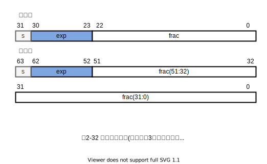

# 第二章 信息的表示和处理

- bit 位
- 无符号 unsigned
- 补码 tow's complement
- 有符号
- 浮点数 floating-point
- 溢出 overflow
- 虚拟内存 巨大的数组 virtual memory
- 十六进制 二进制转化 A C F
- A 1010
- C 1100
- F 1111
- 字长 word size
- 虚拟地址是一个字来编码
- 32位和64位的典型值
- int32_t(4字节) int64_t(8字节) 避免不同编译器之间不同的差异 （ISO 99）
- unsigned long
- unsigned long int
- long unsigned
- long unsigned
- 寻址和字节顺序
- 对象的地址是什么，以及在内存中是如何排列这些字节的
- 前一种规则 最低有效字节在最前面的方式，称为小端法(little endian)
- 后一种规则 最高有效字节在最前面的方式，称为大端法(big endian)
- 网络传输顺序
- 阅读顺序，编译器的顺序
- C语言，指针和数组
- man ascii
- 二进制编码是不兼容的 (大小端)
- 布尔代数 Boolean algebra
- 位向量 表示有限的集合
- 加法逆元 additive inverse (P72)
- C语言 位移操作 (P76)
- 左移
- 逻辑右移 算术右移 (P76)
- 整数的表示
- 数字的权重
- 补码编码 two's-complement (P45)
- 双摄 
- 补码编码的唯一性，函数 B2T ${_w}$ 是一个双摄
- limits.h
- stdint.h
- 有符合的其他表示方法：反码，原码
- 反码，原码 +0，-0 存在两种不同的编码方式
- 反汇编
- 有符号数和无符号数之间的转换
- 零扩展 zero extension
- 算术运算的溢出
- 正常情况下xty的值保持不变，而溢出情况则是该和数减去2 $^w$ 的结果
- IEEE 格式
- IEEE 符号(sign)，阶码(exponent)，尾数(significand)
- 逐渐溢出（gradual underflow)
- NaN Not a Number
- 规格化的+非规格化的 值计算规则在 P79(二进制转换成10进制)

## sizeof

这些过程使用C语言的运算符sizeof来确定对象使用的字节数。一般来说，表达式sizeof(T)返回存储一个类型为T的对象所需要的字节数。使用sizeof而不是一个固定的值，是向编写在不同机器类型上可移植的代码迈进了一步。

## 位移操作

- 逻辑右移：有符合，无符号，的结果都是一样的
- 算术右移：如果是有符合的（负数），那么结果会在最高位填充符号位 


斜体的数字表示的是最右端(左移)或最左端(右移)填充的值。可以看到除了一个条目之外，其他的都包含填充0。唯一的例外是算术右移`[10010101]`的情况。因为操作数的最高位是1，填充的值就是1。

C语言标准并没有明确定义对于有符号数应该使用哪种类型的右移一算术右移或者逻辑右移都可以。不幸地，这就意味着任何假设一种或者另一种右移形式的代码都可能会遇到可移植性问题。然而，实际上，几乎所有的编译器/机器组合都对有符号数使用算术右移，且许多程序员也都假设机器会使用这种右移。另一方面，对于无符号数，右移必须是逻辑的。

与C相比，Java对于如何进行右移有明确的定义。表达是`x>>k`会将x算术右移k个位置，而`x>>>k`会对x做逻辑右移。

## 补码

2.2.3补码编码
对于许多应用，我们还希望表示负数值。最常见的有符号数的计算机表示方式就是补码(two' s-complement)形式。
在这个定义中，将字的最高有效位解释为负权(negative weight)。我们用函数B2Tw (Binary to Two' s-complement的缩写，长度为w)来表示。

## 有符号数和无符号数之间的转换

```c
    short int v =-12345;
    unsigned short uv =(unsigned short)v;
    prinft("v = %d, uv = %u\n", v, uv);
```

(在采用补码的机器上) 强制类型转换的结果保持位值不变，只是改变了解释这些位的方式。(-12345 中 `1100111111000111` 这些bit位没有发生变化。)

```txt
# -12345 11111111111111111100111111000111
# 53191 1100111111000111
v=-12345,uv =53191
```

对于大多数C语言的实现，处理同样字长的有符号数和无符号数之间相互转换的一般规则是:数值可能会改变，但是位模式不变。

## IEEE 浮点数

IEEE 浮点标准用 V=(-1)$^s$×M×2 $^E$ 的形式来表示一个数： 
- 符号（sign) s 决定这数是负数G=l)还是正数0=0)，而对于数值 0 的符号位解释作为特殊情况处理。
- 尾数(significand) M 是一个二进制小数，它的范围是 1 ~2 $-_{\mathrm{e}}$或者是 0~1 $-_{\mathrm{e}}$
- 阶码（exponent) E的作用是对浮点数加权，这个权重是 2 的 E次幂(可能是负数)。’

将浮点数的位表示划分为三个字段，分别对这些值进行编码：
- 一个单独的符号位 s 直接编码符号1 
- k位的阶码字段 exp= $e_{\mathrm{k-1}}$ $\ldots$ $e_{\mathrm{1}}$ $e_{\mathrm{0}}$ 编码阶码
- n 位小数字段 frac=$f_{\mathrm{n-1}}$ $\ldots$ $f_{\mathrm{1}}$ $f_{\mathrm{0}}$ 编码尾数 M,但是编码出来的值也依赖于阶码字
段的值是否等于 0。

图2-32 标准浮点格式(浮点数由3个字段表示。两种最常见的格式是它们被封装到32位(单精度)和64位(双精度)的字中)



- 规格化的 P79
- 非规格化的
- 无穷大
- NaN


## NaN

当小数域为非零时，结果值被称为NaN 即“不是一个数(Not a Number)的缩写。一些运算的结果不能是实数或无穷，就会返回这样的 NaN 值，比如当计算 $\sqrt{-1}$或$+\infty$ $-\infty$ 时。在某些应用中，表示未初始化的数据时，它们也很有用处。

