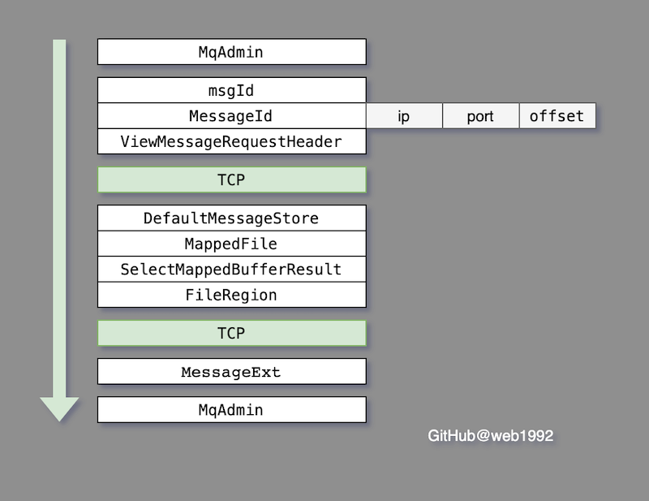

# MQAdminExt

MQAdminExt 提供了通过创建TOPIC，查询消息的一些工具。

下面是根据MessageId查询消息的流转图：



## viewMessage

查询消息

```java

public MessageExt viewMessage(String msgId) throws RemotingException, MQBrokerException, InterruptedException, MQClientException {
    MessageId messageId = null;
    messageId = MessageDecoder.decodeMessageId(msgId);
    return this.mQClientFactory.getMQClientAPIImpl().viewMessage(RemotingUtil.socketAddress2String(messageId.getAddress()), messageId.getOffset(), this.timeoutMillis);
}

// MessageDecoder
// msgId -> MessageId
public static MessageId decodeMessageId(final String msgId) throws UnknownHostException {
    SocketAddress address;
    long offset;
    int ipLength = msgId.length() == 32 ? 4 * 2 : 16 * 2;
    byte[] ip = UtilAll.string2bytes(msgId.substring(0, ipLength));
    byte[] port = UtilAll.string2bytes(msgId.substring(ipLength, ipLength + 8));
    ByteBuffer bb = ByteBuffer.wrap(port);
    int portInt = bb.getInt(0);
    address = new InetSocketAddress(InetAddress.getByAddress(ip), portInt);
    // offset
    byte[] data = UtilAll.string2bytes(msgId.substring(ipLength + 8, ipLength + 8 + 16));
    bb = ByteBuffer.wrap(data);
    offset = bb.getLong(0);
    return new MessageId(address, offset);
}
```

下面是 msgId 的创建代码:

```java
// CommitLog.DefaultAppendMessageCallback#doAppend:1536
String msgId;
if ((sysflag & MessageSysFlag.STOREHOSTADDRESS_V6_FLAG) == 0) {
    msgId = MessageDecoder.createMessageId(this.msgIdMemory, msgInner.getStoreHostBytes(storeHostHolder), wroteOffset);
} else {
    msgId = MessageDecoder.createMessageId(this.msgIdV6Memory, msgInner.getStoreHostBytes(storeHostHolder), wroteOffset);
}
// MessageDecoder 创建MessageId
public static String createMessageId(final ByteBuffer input, final ByteBuffer addr, final long offset) {
    input.flip();
    int msgIDLength = addr.limit() == 8 ? 16 : 28;
    input.limit(msgIDLength);
    input.put(addr);
    input.putLong(offset);
    return UtilAll.bytes2string(input.array());
}
```

## ViewMessageRequestHeader

会发送 ViewMessageRequestHeader 请求到Broker查询消息，会调用 MessageStore 查询消息

```java
final SelectMappedBufferResult selectMappedBufferResult =
            this.brokerController.getMessageStore().selectOneMessageByOffset(requestHeader.getOffset());
```

## DefaultMessageStore

```java
public SelectMappedBufferResult selectOneMessageByOffset(long commitLogOffset) {
    // 第一次读取，读取消息的总长度 TOTALSIZE，注意这个4，4是消息存储在磁盘的中的TOTALSIZE，也就是消息的总长度。
    SelectMappedBufferResult sbr = this.commitLog.getMessage(commitLogOffset, 4);
    if (null != sbr) {
        try {
            // 1 TOTALSIZE
            int size = sbr.getByteBuffer().getInt();
            // 第二次根据总长度，再读取消息体
            return this.commitLog.getMessage(commitLogOffset, size);
        } finally {
            sbr.release();
        }
    }

    return null;
}
```

可参考序列化实现 [rocketmq序列化实现](rocketmq-serialize.md)

从 DefaultMessageStore 执行，最终执行到 `MappedFileQueue`

```java
// offset 参数是消息所在的物理偏移位置。
// MappedFileQueue
public MappedFile findMappedFileByOffset(final long offset, final boolean returnFirstOnNotFound) {
    try {
        MappedFile firstMappedFile = this.getFirstMappedFile();
        MappedFile lastMappedFile = this.getLastMappedFile();
        if (firstMappedFile != null && lastMappedFile != null) {
            if (offset < firstMappedFile.getFileFromOffset() || offset >= lastMappedFile.getFileFromOffset() + this.mappedFileSize) {
                // log ...
            } else {
                // 计算index
                // MappedFile 文件可以已经被删除了，如果offset在已经被删除的文件中。那么index<0,是查询不到MappedFile的。
                // 走后面的循环所有的MappedFile去查找MappedFile
                int index = (int) ((offset / this.mappedFileSize) - (firstMappedFile.getFileFromOffset() / this.mappedFileSize));
                MappedFile targetFile = null;
                try {// 快速查找 MappedFile
                    targetFile = this.mappedFiles.get(index);
                } catch (Exception ignored) {
                }
                // 校验offset是否合法
                if (targetFile != null && offset >= targetFile.getFileFromOffset()
                    && offset < targetFile.getFileFromOffset() + this.mappedFileSize) {
                    return targetFile;
                }
                // 没有查询到，循环处理查找 MappedFile
                for (MappedFile tmpMappedFile : this.mappedFiles) {
                    if (offset >= tmpMappedFile.getFileFromOffset()
                        && offset < tmpMappedFile.getFileFromOffset() + this.mappedFileSize) {
                        return tmpMappedFile;
                    }
                }
            }
            if (returnFirstOnNotFound) {
                return firstMappedFile;
            }
        }
    } catch (Exception e) {
        log.error("findMappedFileByOffset Exception", e);
    }
    return null;
}
```

最后通过下面代码写入到IO中，经过TCP传输到客户端

```java
try {
    // selectMappedBufferResult 转化成 FileRegion 进行IO传输
    FileRegion fileRegion =
        new OneMessageTransfer(response.encodeHeader(selectMappedBufferResult.getSize()),
            selectMappedBufferResult);
    ctx.channel().writeAndFlush(fileRegion).addListener(new ChannelFutureListener() {
        @Override
        public void operationComplete(ChannelFuture future) throws Exception {
            selectMappedBufferResult.release();
            if (!future.isSuccess()) {
                log.error("Transfer one message from page cache failed, ", future.cause());
            }
        }
    });
} catch (Throwable e) {
    log.error("", e);
    selectMappedBufferResult.release();
}
```
