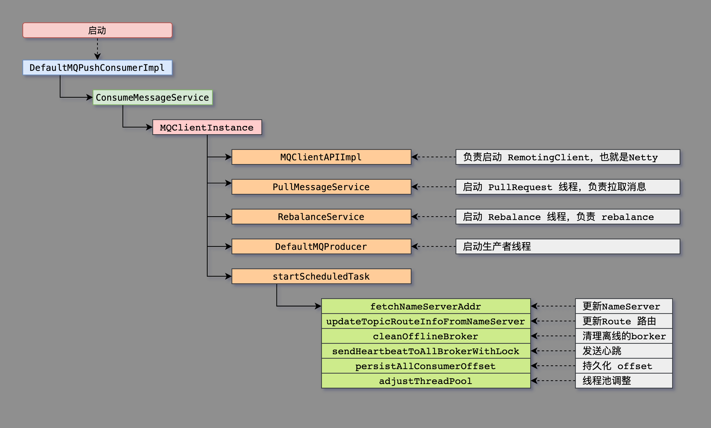
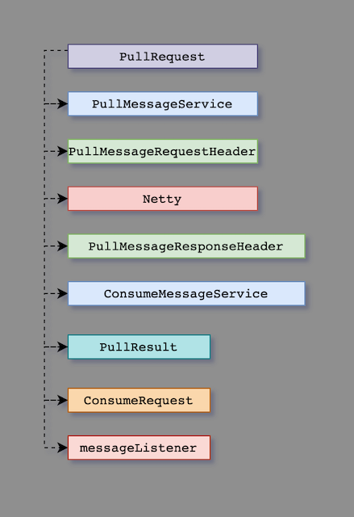

# Consumer

RocketMQ 消费消息的实现解析。

目录：

- [Consumer](#consumer)
  - [消息的创建和消费](#消息的创建和消费)
  - [消息消费的核心类](#消息消费的核心类)
  - [Consumer的启动](#consumer的启动)
  - [DefaultMQPushConsumerImpl#start](#defaultmqpushconsumerimplstart)
  - [DefaultMQPushConsumerImpl#pullMessage](#defaultmqpushconsumerimplpullmessage)
    - [PullRequest](#pullrequest)
    - [PullResult](#pullresult)
  - [ConsumeRequest](#consumerequest)
  - [ConsumeMessageService#processConsumeResult](#consumemessageserviceprocessconsumeresult)
  - [RebalancePushImpl#computePullFromWhere](#rebalancepushimplcomputepullfromwhere)
  - [MQClientInstance#start](#mqclientinstancestart)
  - [PullMessageService](#pullmessageservice)
  - [ConsumeMessageOrderlyService](#consumemessageorderlyservice)
  - [RebalanceImpl](#rebalanceimpl)

可以了解的内容：

- Consumer 消费消息的流程
- Consumer 消费消息失败了，怎么处理
- Consumer 在重启之后，如何继续上一次消费的位置，继续处理
- Consumer 为什么需要重平衡(rebalance)

## 消息的创建和消费


## 消息消费的核心类

RockerMQ 中的（Client）Consumer 实现也是比较复杂的，主要是涉及的类很多，而且各个类之间都相互关联。
虽然 Consumer 的主要作用是消费消息，但是很多功能都是在 Consumer 端实现的。
比如：1.拉取消息进行消费。2.消息消费失败，重新发回到MQ，3.多个 Consumer 消费者之间的`负载均衡`，4.持久化消费者的 offset 等等。

而下图中的类，就是负责上述的这些功能（类真的多！）。


如果我们不关心实现，只消费消息。我们使用 `DefaultMQPushConsumer` 和 `MessageListenerConcurrently`(`MessageListener`) 就可以完成消息的消费了。
但是如果我们要关心实现，那么上图中的类，都需要了解，下面对主要的类进行简单的说明：

- `DefaultMQPushConsumer` （Consumer 入口）负责 Consumer 的启动&管理配置参数
- `DefaultMQPushConsumerImpl` 负责发送 `PullReques`t 拉消息,包含 `ConsumeMessageService` 和 `MQClientInstance`
- `ConsumeMessageService` 负责处理消息服务(有 `ConsumeMessageConcurrentlyService` 和 `ConsumeMessageOrderlyService` )两种实现
- `MQClientInstance` 负责底层的通信
- `RebalanceImpl` 执行 rebalance

## Consumer的启动

消息消费者(client)的启动过程(这里列举了启动的核心类)：

```java
DefaultMQPushConsumer#start
    ->DefaultMQPushConsumerImpl#start
        -> this.consumeMessageService.start();
        -> this.mQClientFactory.start();// MQClientInstance
            -> this.mQClientAPIImpl.start();// MQClientInstance 启动 Netty client
            -> this.startScheduledTask();// MQClientInstance 定时任务
            -> this.pullMessageService.start();// PullMessageService 
            -> this.rebalanceService.start();// RebalanceService
            -> this.defaultMQProducer.getDefaultMQProducerImpl().start(false);
```



下面是各个启动类的代码片段：

## DefaultMQPushConsumerImpl#start

`DefaultMQPushConsumerImpl` 的主要功能是 拉取消息进行消费，下面 从 `start` 和 `pullMessage` 方法中去了解消息消费的核心。

消息消费的启动过程如下：

```java
// DefaultMQPushConsumerImpl#start
// 1. 检查配置
// 2. copy copySubscription
// 3. 创建 mQClientFactory
// 4. 创建 pullAPIWrapper
// 5. 注册 filterMessageHookList
// 6. 获取 offsetStore 并且加载 offset
// 7. 创建 consumeMessageService 并且启动，有序的 ConsumeMessageOrderlyService , 无序的的 ConsumeMessageConcurrentlyService
// 8. 注册 Consumer mQClientFactory.registerConsumer
// 9. 启动 mQClientFactory
// 10. 更新 topic 的订阅信息
// 11. 校验 checkClientInBroker
// 12. 发送心跳到 broker
// 13. rebalanceImmediately 执行 rebalance 操作
public synchronized void start() throws MQClientException {
// ...
this.updateTopicSubscribeInfoWhenSubscriptionChanged();// 10
this.mQClientFactory.checkClientInBroker();// 11
this.mQClientFactory.sendHeartbeatToAllBrokerWithLock();// 12
this.mQClientFactory.rebalanceImmediately();// 13
}
```

## DefaultMQPushConsumerImpl#pullMessage

1. 拉取消息的启动和准备阶段。获取消息的过程如下：

```java
// DefaultMQPushConsumerImpl#pullMessage
// pullMessage 方法的声明,注意返回值是 void，参数是 PullRequest

// 1. 检查 ProcessQueue
// 2. 更新 ProcessQueue 的 lastPullTimestamp
// 3. 检查 serviceState 状态
// 4. 检查 DefaultMQPushConsumerImpl 的 pause 标记
// 5. 检查 cachedMessageCount （在 ProcessQueue 中），如果超过，则延迟 PullRequest
// 6. 检查 cachedMessageSizeInMiB 的大小。超过多少100M，则延迟 PullRequest
// 7. 如果是按照顺序消费&检查 getMaxSpan 是否超过 2000，超过则延迟 PullRequest
// 8. 检查 processQueue 的锁状态
// 9. 检查是否是一次 pull Msg,计算 offset 从哪里开始消费，并更新 offset
// 10. 获取 SubscriptionData  
// 11. 包装 PullCallback
// 12. 获取  commitOffsetValue
// 13. 获取  SubscriptisonData
// 14. build  sysFlag
// 15. 执行 pullKernelImpl (本质是发送 PullMessageRequestHeader 去拉消息)
//  ↓
//  TCP
//  ↓
// 这里说明下，把 PullMessageRequestHeader broker 之后，等待异步响应，
// 获取  PullMessageResponseHeader 响应之后，执行回调 PullCallback
public void pullMessage(final PullRequest pullRequest) {
// ...   
}
```

消息消费的简化图：



### PullRequest

2.执行拉取消息的阶段

`org.apache.rocketmq.client.impl.consumer.PullRequest` 是一个拉取消息的`请求`类。首先 PullRequest 会在 `RebalanceImpl` 中创建，然后加入到 PullMessageService 线程的 queue 中。
PullMessageService 线程会对 queue 执行 take 操作，执行拉取操作。无论是否新消息，在进行拉取消息之后， 然后再把 PullRequest 放入到 queue 中,以此循环。

```java
// RebalanceImpl 中 PullRequest 的创建
PullRequest pullRequest = new PullRequest();
pullRequest.setConsumerGroup(consumerGroup);
pullRequest.setNextOffset(nextOffset);
pullRequest.setMessageQueue(mq);
pullRequest.setProcessQueue(pq);
pullRequestList.add(pullRequest);
```

在 PullCallback 中会执行拉消息的回调处理，在这里会更新 `nextOffset`,代码片段如下：

```java
long prevRequestOffset = pullRequest.getNextOffset();
// 使用 pullResult 更新 nextOffset
pullRequest.setNextOffset(pullResult.getNextBeginOffset());
```

### PullResult

`org.apache.rocketmq.client.consumer.PullResult` 是拉取消息的结果

```java
// PullCallback 在中的 PullResult
PullCallback pullCallback = new PullCallback() {
    @Override
    public void onSuccess(PullResult pullResult) {
        // 处理 PullResult
    }
}

// PullResult 的字段
public class PullResult {
    private final PullStatus pullStatus;
    private final long nextBeginOffset;
    private final long minOffset;
    private final long maxOffset;
    private List<MessageExt> msgFoundList;
}
```

## ConsumeRequest

3.在获取到`PullResult`之后，进入到消费消息的阶段。

```java
// 在获取到 PullResult 之后，执行 ConsumeMessageService 的 submitConsumeRequest 方法
DefaultMQPushConsumerImpl.this.consumeMessageService.submitConsumeRequest(
                                    pullResult.getMsgFoundList(),
                                    processQueue,
                                    pullRequest.getMessageQueue(),
                                    dispatchToConsume);
// submitConsumeRequest 方法
public void submitConsumeRequest(
    final List<MessageExt> msgs,
    final ProcessQueue processQueue,
    final MessageQueue messageQueue,
    final boolean dispatchToConsume) {
    // 包装 ConsumeRequest
    ConsumeRequest consumeRequest = new ConsumeRequest(msgs, processQueue, messageQueue);
    // 提交给线程池，进行异步的消费处理
    this.consumeExecutor.submit(consumeRequest);
}
```

消息消费的代码片段。

```java
// org.apache.rocketmq.client.impl.consumer.ConsumeMessageConcurrentlyService.ConsumeRequest
// org.apache.rocketmq.client.impl.consumer.ConsumeMessageOrderlyService.ConsumeRequest
class ConsumeRequest implements Runnable {
// ConsumeRequest 实现了 Runnable 可以提交给线程池
}

// 以 ConsumeMessageConcurrentlyService 中的 ConsumeRequest 为例子
// ConsumeRequest 的创建
// 三个参数：
// List<MessageExt> msgs
// ProcessQueue processQueue
// MessageQueue messageQueue
ConsumeRequest consumeRequest = new ConsumeRequest(msgs, processQueue, messageQueue);

// run 方法
@Override
public void run() {
    // ...
    MessageListenerConcurrently listener = 
    // ... 消费消息
    status = listener.consumeMessage(Collections.unmodifiableList(msgs), context); 
}
```

## ConsumeMessageService#processConsumeResult

处理消费结果，这里能找到消息消费失败之后的处理，把消息再次`发回`到 Broker。

```java
//  ConsumeMessageConcurrentlyService 的代码片段
public void processConsumeResult(
    final ConsumeConcurrentlyStatus status,
    final ConsumeConcurrentlyContext context,
    final ConsumeRequest consumeRequest
) {
// 省略了其他代码...
int ackIndex = consumeRequest.getMsgs().size() - 1;
 switch (status) {
     case CONSUME_SUCCESS:// 成功 +1
         int ok = ackIndex + 1;
         break;
     case RECONSUME_LATER:// 失败 -1
         ackIndex = -1;
         break;
     default:
         break;
 }

switch (this.defaultMQPushConsumer.getMessageModel()) {
    case BROADCASTING:
        // print log 
        break;
    case CLUSTERING:
        List<MessageExt> msgBackFailed = new ArrayList<MessageExt>(consumeRequest.getMsgs().size());
        for (int i = ackIndex + 1; i < consumeRequest.getMsgs().size(); i++) {
            MessageExt msg = consumeRequest.getMsgs().get(i);
            boolean result = this.sendMessageBack(msg, context);// 消费失败，发送回去到 MQ
            if (!result) {
                msg.setReconsumeTimes(msg.getReconsumeTimes() + 1);
                msgBackFailed.add(msg);
            }
        }
        if (!msgBackFailed.isEmpty()) {// 发送到MQ失败，继续消费
            consumeRequest.getMsgs().removeAll(msgBackFailed);
            this.submitConsumeRequestLater(msgBackFailed, consumeRequest.getProcessQueue(), consumeRequest.getMessageQueue());
        }
        break;
    default:
        break;
}
}
```

## RebalancePushImpl#computePullFromWhere

消费者，从哪里开始消费的实现

[computePullFromWhere 源码](https://github.com/apache/rocketmq/blob/master/client/src/main/java/org/apache/rocketmq/client/impl/consumer/RebalancePushImpl.java#L141)

```java
// 是否是第一次 pull Msg
if (!pullRequest.isLockedFirst()) {
         // 获取 offset
         final long offset = this.rebalanceImpl.computePullFromWhere(pullRequest.getMessageQueue());
         // 更新 offset
         pullRequest.setNextOffset(offset);
}
```

`computePullFromWhere` 的实现

```java
public long computePullFromWhere(MessageQueue mq) {
//...
switch (consumeFromWhere) {
    case CONSUME_FROM_LAST_OFFSET_AND_FROM_MIN_WHEN_BOOT_FIRST:// 废弃
    case CONSUME_FROM_MIN_OFFSET:// 废弃
    case CONSUME_FROM_MAX_OFFSET:// 废弃
    case CONSUME_FROM_LAST_OFFSET: {//case1
        break;
    }
    case CONSUME_FROM_FIRST_OFFSET: {//case2
        break;
    }
    case CONSUME_FROM_TIMESTAMP: {//case3
        break;
    }
}
// 上面的三个 case 都是执行 readOffset 方法，获取 lastOffset
// long lastOffset = offsetStore.readOffset(mq, ReadOffsetType.READ_FROM_STORE);
// case1: 如果是第一次消费(lastOffset=-1) 获取 getMQAdminImpl().maxOffset 否则使用 lastOffset
// case2: 如果是第一次消费,lastOffset=0,否则使用 lastOffset
// case3: 如果是第一次消费,getMQAdminImpl().searchOffset(mq,timestamp) 查找Offset，否则使用 lastOffset
```

简单的代码流程：

```java
`RemoteBrokerOffsetStore`(`OffsetStore`) -> readOffset
-> MQClientInstance
-> MQClientAPIImpl -> queryConsumerOffset
-> QueryConsumerOffsetRequestHeader // 发送查询 Request
-> Borker // Borker 进行处理，发送 Response
-> QueryConsumerOffsetResponseHeader // 处理 Response
-> offset // 获取 offset
```

## MQClientInstance#start

```java
// MQClientInstance 的启动
public void start() throws MQClientException {
    synchronized (this) {
        switch (this.serviceState) {
            case CREATE_JUST:
                this.serviceState = ServiceState.START_FAILED;
                // If not specified,looking address from name server
                if (null == this.clientConfig.getNamesrvAddr()) {
                    this.mQClientAPIImpl.fetchNameServerAddr();
                }
                // Start request-response channel
                this.mQClientAPIImpl.start();
                // Start various schedule tasks
                this.startScheduledTask();
                // Start pull service
                this.pullMessageService.start();
                // Start rebalance service
                this.rebalanceService.start();
                // Start push service
                this.defaultMQProducer.getDefaultMQProducerImpl().start(false);
                log.info("the client factory [{}] start OK", this.clientId);
                this.serviceState = ServiceState.RUNNING;
                break;
            case START_FAILED:
                throw new MQClientException("The Factory object[" + this.getClientId() + "] has been created before, and failed.", null);
            default:
                break;
        }
    }
}
```

## PullMessageService

```java
// PullMessageService 的定义，本质是一个线程
public class PullMessageService extends ServiceThread {
// ...    
}
// 线程的 Run 方法
public void run() {
   // ...
    this.pullMessage(pullRequest);
   //...
}

// 拉取消息
private void pullMessage(final PullRequest pullRequest) {
    final MQConsumerInner consumer = this.mQClientFactory.selectConsumer(pullRequest.getConsumerGroup());
    if (consumer != null) {
        DefaultMQPushConsumerImpl impl = (DefaultMQPushConsumerImpl) consumer;
        impl.pullMessage(pullRequest);
    } else {
        log.warn("No matched consumer for the PullRequest {}, drop it", pullRequest);
    }
}
```

上面的 `pullMessage` 方法最终会调用 `DefaultMQPushConsumerImpl#pullMessage` 方法

## ConsumeMessageOrderlyService

顺序消费消息的实现

## RebalanceImpl

`Rebalance` 的实现

| ConsumerImpl                | Rebalance             |
| --------------------------- | --------------------- |
| DefaultMQPushConsumerImpl   | RebalancePushImpl     |
| DefaultLitePullConsumerImpl | RebalanceLitePullImpl |
| DefaultMQPullConsumerImpl   | RebalancePullImpl     |

```java
// DefaultMQPushConsumerImpl
private final RebalanceImpl rebalanceImpl = new RebalancePushImpl(this);
```

核心方法

```java
public void doRebalance(final boolean isOrder) {
    Map<String, SubscriptionData> subTable = this.getSubscriptionInner();
    if (subTable != null) {
        for (final Map.Entry<String, SubscriptionData> entry : subTable.entrySet()) {
            final String topic = entry.getKey();
            try {
                this.rebalanceByTopic(topic, isOrder);
            } catch (Throwable e) {
                if (!topic.startsWith(MixAll.RETRY_GROUP_TOPIC_PREFIX)) {
                    log.warn("rebalanceByTopic Exception", e);
                }
            }
        }
    }
    this.truncateMessageQueueNotMyTopic();
}
```

`AllocateMessageQueueStrategy`
