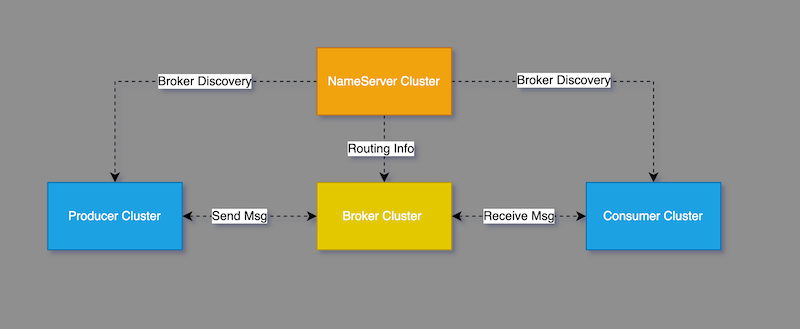
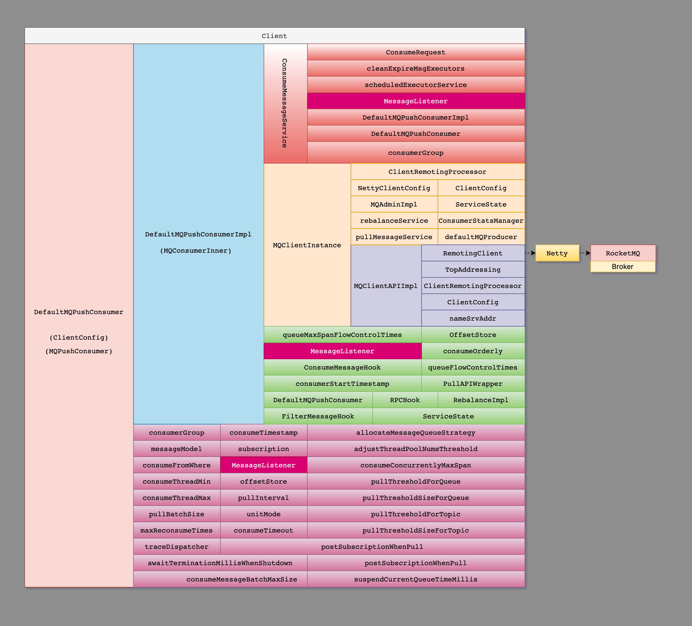

# Consumer

- [Consumer](#consumer)
  - [Consumer start](#consumer-start)
  - [消息的创建和消费](#消息的创建和消费)
  - [消息消费的核心类](#消息消费的核心类)
  - [DefaultMQPushConsumerImpl](#defaultmqpushconsumerimpl)
    - [DefaultMQPushConsumerImpl 的启动](#defaultmqpushconsumerimpl-的启动)
    - [DefaultMQPushConsumerImpl#pullMessage](#defaultmqpushconsumerimplpullmessage)
  - [ProcessQueue](#processqueue)
  - [ConsumeRequest](#consumerequest)
  - [RebalancePushImpl#computePullFromWhere](#rebalancepushimplcomputepullfromwhere)
  - [MQClientInstance](#mqclientinstance)
    - [MQClientInstance#start](#mqclientinstancestart)
  - [PullMessageService](#pullmessageservice)
  - [ConsumeMessageConcurrentlyService](#consumemessageconcurrentlyservice)
  - [ConsumeMessageOrderlyService](#consumemessageorderlyservice)
  - [RemotingClient](#remotingclient)

可以了解的内容：

- Consumer 消费消息的流程
- Consumer 消费消息失败了，怎么处理
- Consumer 在重启之后，如何继续上一次消费的位置，继续处理
- Consumer 为什么需要重平衡(rebalance)的

## Consumer start

消息消费者的启动过程：

```java
DefaultMQPushConsumer#start
    ->DefaultMQPushConsumerImpl#start
        -> this.consumeMessageService.start();
        -> this.mQClientFactory.start();// MQClientInstance
            -> this.mQClientAPIImpl.start();// MQClientInstance 启动 Netty client
            -> this.startScheduledTask();// MQClientInstance 定时任务
            -> this.pullMessageService.start();// PullMessageService 
            -> this.rebalanceService.start();// RebalanceService
            -> this.defaultMQProducer.getDefaultMQProducerImpl().start(false);
```

## 消息的创建和消费



## 消息消费的核心类



- `DefaultMQPushConsumer` （Consumer 入口）负责 Consumer 的启动&管理配置参数
- `DefaultMQPushConsumerImpl` 核心实现类，包含 `ConsumeMessageService` 和 `MQClientInstance`
- `MQClientInstance` 负责底层的通信
- `ConsumeMessageService` 负责处理消息服务

## DefaultMQPushConsumerImpl

### DefaultMQPushConsumerImpl 的启动

```java
// 1. 检查配置
// 2. copy copySubscription
// 3. 创建 mQClientFactory
// 4. 创建 pullAPIWrapper
// 5. 注册 filterMessageHookList
// 6. 获取offsetStore 并且加载 offset
// 7. 创建 consumeMessageService 并且启动，有序的 ConsumeMessageOrderlyService , 无序的的 ConsumeMessageConcurrentlyService
// 8. 注册 Consumer mQClientFactory.registerConsumer
// 9. 启动 mQClientFactory
// 10. 更新 topic 的订阅信息
// 11. 校验 checkClientInBroker
// 12. 发送心跳到 broker
// 13. rebalanceImmediately 执行 rebalance 操作
public synchronized void start() throws MQClientException {
// ...
}
```

### DefaultMQPushConsumerImpl#pullMessage

```java
// pullMessage 方法的声明,注意返回值是 void，参数是 PullRequest

// 1. 检查 ProcessQueue
// 2. 更新 ProcessQueue 的 lastPullTimestamp
// 3. 检查 serviceState 状态
// 4. 检查 DefaultMQPushConsumerImpl 的 pause 标记
// 5. 检查 cachedMessageCount （在 ProcessQueue 中），如果超过，则延迟 PullRequest
// 6. 检查 cachedMessageSizeInMiB 的大小。超过多少100M，则延迟 PullRequest
// 7. 如果是按照顺序消费&检查 getMaxSpan 是否超过 2000，超过则延迟 PullRequest
// 8. 检查 processQueue 的锁状态
// 9. 检查是否是一次 pull Msg,计算 offset 从哪里开始消费，并更新 offset
// 10. 获取 SubscriptionData  
// 11. 包装 PullCallback
// 12. 获取  commitOffsetValue
// 13. 获取  SubscriptionData
// 14. build  sysFlag
// 15. 执行 pullKernelImpl (本质是发送 PullMessageRequestHeader 去拉消息)
//  ↓
//  TCP
//  ↓
// 这里说明下，把 PullMessageRequestHeader broker 之后，等待异步响应，
// 获取  PullMessageResponseHeader 响应之后，执行回调 PullCallback
public void pullMessage(final PullRequest pullRequest) {
// ...   
}
```

## ProcessQueue

## ConsumeRequest

```java
ConsumeRequest consumeRequest = new ConsumeRequest(msgs, processQueue, messageQueue);
```

## RebalancePushImpl#computePullFromWhere

[computePullFromWhere 源码](https://github.com/apache/rocketmq/blob/master/client/src/main/java/org/apache/rocketmq/client/impl/consumer/RebalancePushImpl.java#L141)

```java
// 是否是第一次 pull Msg
if (!pullRequest.isLockedFirst()) {
         // 获取 offset
         final long offset = this.rebalanceImpl.computePullFromWhere(pullRequest.getMessageQueue());
         // 更新 offset
         pullRequest.setNextOffset(offset);
}
```

`computePullFromWhere` 的实现

```java
public long computePullFromWhere(MessageQueue mq) {
//...
switch (consumeFromWhere) {
    case CONSUME_FROM_LAST_OFFSET_AND_FROM_MIN_WHEN_BOOT_FIRST:// 废弃
    case CONSUME_FROM_MIN_OFFSET:// 废弃
    case CONSUME_FROM_MAX_OFFSET:// 废弃
    case CONSUME_FROM_LAST_OFFSET: {//case1
        break;
    }
    case CONSUME_FROM_FIRST_OFFSET: {//case2
        break;
    }
    case CONSUME_FROM_TIMESTAMP: {//case3
        break;
    }
}
// 上面的三个 case 都是执行 readOffset 方法，获取 lastOffset
// long lastOffset = offsetStore.readOffset(mq, ReadOffsetType.READ_FROM_STORE);
// case1: 如果是第一次消费(lastOffset=-1) 获取 getMQAdminImpl().maxOffset 否则使用 lastOffset
// case2: 如果是第一次消费,lastOffset=0,否则使用 lastOffset
// case3: 如果是第一次消费,getMQAdminImpl().searchOffset(mq,timestamp) 查找Offset，否则使用 lastOffset
```

## MQClientInstance

### MQClientInstance#start

```java
// MQClientInstance 的启动
public void start() throws MQClientException {
    synchronized (this) {
        switch (this.serviceState) {
            case CREATE_JUST:
                this.serviceState = ServiceState.START_FAILED;
                // If not specified,looking address from name server
                if (null == this.clientConfig.getNamesrvAddr()) {
                    this.mQClientAPIImpl.fetchNameServerAddr();
                }
                // Start request-response channel
                this.mQClientAPIImpl.start();
                // Start various schedule tasks
                this.startScheduledTask();
                // Start pull service
                this.pullMessageService.start();
                // Start rebalance service
                this.rebalanceService.start();
                // Start push service
                this.defaultMQProducer.getDefaultMQProducerImpl().start(false);
                log.info("the client factory [{}] start OK", this.clientId);
                this.serviceState = ServiceState.RUNNING;
                break;
            case START_FAILED:
                throw new MQClientException("The Factory object[" + this.getClientId() + "] has been created before, and failed.", null);
            default:
                break;
        }
    }
}
```

## PullMessageService

```java
// PullMessageService 的定义，本质是一个线程
public class PullMessageService extends ServiceThread {
// ...    
}
// 线程的 Run 方法
public void run() {
   // ...
    this.pullMessage(pullRequest);
   //...
}

// 拉取消息
private void pullMessage(final PullRequest pullRequest) {
    final MQConsumerInner consumer = this.mQClientFactory.selectConsumer(pullRequest.getConsumerGroup());
    if (consumer != null) {
        DefaultMQPushConsumerImpl impl = (DefaultMQPushConsumerImpl) consumer;
        impl.pullMessage(pullRequest);
    } else {
        log.warn("No matched consumer for the PullRequest {}, drop it", pullRequest);
    }
}
```

## ConsumeMessageConcurrentlyService

## ConsumeMessageOrderlyService

## RemotingClient

```java
// RemotingClient 的初始化
public MQClientAPIImpl(final NettyClientConfig nettyClientConfig,
    final ClientRemotingProcessor clientRemotingProcessor,
    RPCHook rpcHook, final ClientConfig clientConfig) {
    this.clientConfig = clientConfig;
    topAddressing = new TopAddressing(MixAll.getWSAddr(), clientConfig.getUnitName());
    this.remotingClient = new NettyRemotingClient(nettyClientConfig, null);
    this.clientRemotingProcessor = clientRemotingProcessor;
    this.remotingClient.registerRPCHook(rpcHook);
    this.remotingClient.registerProcessor(RequestCode.CHECK_TRANSACTION_STATE, this.clientRemotingProcessor, null);
    this.remotingClient.registerProcessor(RequestCode.NOTIFY_CONSUMER_IDS_CHANGED, this.clientRemotingProcessor, null);
    this.remotingClient.registerProcessor(RequestCode.RESET_CONSUMER_CLIENT_OFFSET, this.clientRemotingProcessor, null);
    this.remotingClient.registerProcessor(RequestCode.GET_CONSUMER_STATUS_FROM_CLIENT, this.clientRemotingProcessor, null);
    this.remotingClient.registerProcessor(RequestCode.GET_CONSUMER_RUNNING_INFO, this.clientRemotingProcessor, null);
    this.remotingClient.registerProcessor(RequestCode.CONSUME_MESSAGE_DIRECTLY, this.clientRemotingProcessor, null);
    this.remotingClient.registerProcessor(RequestCode.PUSH_REPLY_MESSAGE_TO_CLIENT, this.clientRemotingProcessor, null);
}
```
