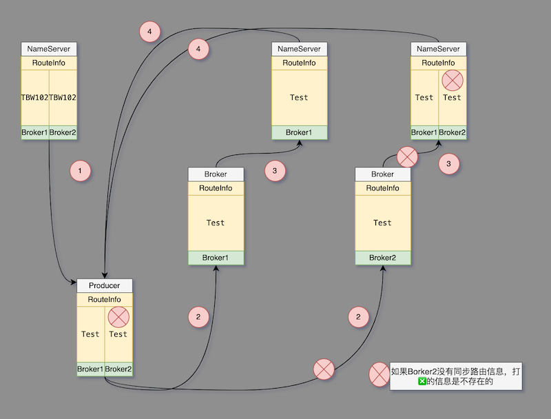

# Producer

新手在使用第一次使用 RocketMQ 进行发送消息的时候，经常会遇到 `No route info of this topic: XXX`错误,如果去搜索解决方案，
一般的建议是 1.开启自动创建 Topic 2.手动创建Topic 之后再发送消息即可。而这个其中的原因是由于`Topic`的路由机制导致的。

而了解这个问题的深层的原因需要从`RocketMQ`的`Producer`消息发送入手。

## 路由信息

首先看下，为什么需要路由信息。如下图：


RocketMQ 是支持集群的，如果存在多个Borker1,Borker2。那么`Producer`在发送消息的时候是如何把`Msg`平均的发送到每一个`Borker`中是一个需要解决的问题。
而`RocketMQ`就是通过引入`路由`这个东西来解决的。在引入路由之后，再通过 MessageQueue 来确定消息到底发送到哪个 Queue 中。而 Queue 一般都是平均的分配给
Broker的，最终可以达到消息平均分布在Broker中的目的。

## Msg 的发送概述

Producer 发送消息的前端是需要确定 queueId 确定了QueueId 也就确定了，消息最终会发送到哪个 Broker 中。
而确定 QueueId 是最复杂的流程。确定QueueId 需要3个角色的参与。Producer，NameServer，Broker 3个角色。

下面分别说明3个角色的各自的作用：

__NameServer 端：__

1. NameServer 启动,等待Borker的注册

__Broker 端：__

1. Broker 启动
2. 启动之后，注册自己到 NameServer

__Producer 端：__

1. 启动 Producer
2. 发送消息时，从 NameServer 获取路由信息
3. 获取路由信息成功，发送消息

`MQClientInstance#updateTopicRouteInfoFromNameServer` 方法查询`Topic=TBW102`的路由信息。代码如下：

```java
// Producer 在发下消息的时候，查询路由信息的代码片段
 private TopicPublishInfo tryToFindTopicPublishInfo(final String topic) {
     // 先使用自身Topic查询路由信息
     TopicPublishInfo topicPublishInfo = this.topicPublishInfoTable.get(topic);
     if (null == topicPublishInfo || !topicPublishInfo.ok()) {
         this.topicPublishInfoTable.putIfAbsent(topic, new TopicPublishInfo());
         this.mQClientFactory.updateTopicRouteInfoFromNameServer(topic);
         topicPublishInfo = this.topicPublishInfoTable.get(topic);
     }

     if (topicPublishInfo.isHaveTopicRouterInfo() || topicPublishInfo.ok()) {
         return topicPublishInfo;
     } else {// 如果没查询到路由信息，使用默认的 TBW102 去查询路由信息。
         this.mQClientFactory.updateTopicRouteInfoFromNameServer(topic, true, this.defaultMQProducer);
         topicPublishInfo = this.topicPublishInfoTable.get(topic);
         return topicPublishInfo;
     }
 }

// defaultMQProducer.getCreateTopicKey()= TBW102
topicRouteData = this.mQClientAPIImpl.getDefaultTopicRouteInfoFromNameServer(defaultMQProducer.getCreateTopicKey(),
                            1000 * 3);
```

如果开启了自动创建Topic,Borker 才会把`Topic=TBW102` 放入到路由信息中，同时才会被同步到NameServer中。上面的方法才能查询到路由信息。
自从创建`TBW102`的代码片段如下：

```java
// TopicConfigManager 中 自动创建 Topic 的代码
if (this.brokerController.getBrokerConfig().isAutoCreateTopicEnable()) {
    String topic = TopicValidator.AUTO_CREATE_TOPIC_KEY_TOPIC;// TBW102
    TopicConfig topicConfig = new TopicConfig(topic);
    TopicValidator.addSystemTopic(topic);
    topicConfig.setReadQueueNums(this.brokerController.getBrokerConfig()
        .getDefaultTopicQueueNums());
    topicConfig.setWriteQueueNums(this.brokerController.getBrokerConfig()
        .getDefaultTopicQueueNums());
    int perm = PermName.PERM_INHERIT | PermName.PERM_READ | PermName.PERM_WRITE;
    topicConfig.setPerm(perm);
    this.topicConfigTable.put(topicConfig.getTopicName(), topicConfig);// 放入到 topicConfigTable 中
}
```


`MQClientInstance#topicRouteData2TopicPublishInfo` 方法把 `TopicRouteData` 转化成 `TopicPublishInfo`（里面维护了 MessageQueue）

TopicConfig


TopicRouteData


`TopicPublishInfo`

```java
public class TopicPublishInfo {
    private boolean orderTopic = false;
    private boolean haveTopicRouterInfo = false;
    private List<MessageQueue> messageQueueList = new ArrayList<MessageQueue>();
    private volatile ThreadLocalIndex sendWhichQueue = new ThreadLocalIndex();
    private TopicRouteData topicRouteData;
}
```

## MessageQueue 的选择

```java
// MQFaultStrategy#selectOneMessageQueue
public MessageQueue selectOneMessageQueue(final TopicPublishInfo tpInfo, final String lastBrokerName) {
    if (this.sendLatencyFaultEnable) {
        try {
            int index = tpInfo.getSendWhichQueue().getAndIncrement();
            for (int i = 0; i < tpInfo.getMessageQueueList().size(); i++) {
                int pos = Math.abs(index++) % tpInfo.getMessageQueueList().size();
                if (pos < 0)
                    pos = 0;
                MessageQueue mq = tpInfo.getMessageQueueList().get(pos);
                if (latencyFaultTolerance.isAvailable(mq.getBrokerName()))
                    return mq;
            }
            final String notBestBroker = latencyFaultTolerance.pickOneAtLeast();
            int writeQueueNums = tpInfo.getQueueIdByBroker(notBestBroker);
            if (writeQueueNums > 0) {
                final MessageQueue mq = tpInfo.selectOneMessageQueue();
                if (notBestBroker != null) {
                    mq.setBrokerName(notBestBroker);
                    mq.setQueueId(tpInfo.getSendWhichQueue().getAndIncrement() % writeQueueNums);
                }
                return mq;
            } else {
                latencyFaultTolerance.remove(notBestBroker);
            }
        } catch (Exception e) {
            log.error("Error occurred when selecting message queue", e);
        }
        return tpInfo.selectOneMessageQueue();
    }
    return tpInfo.selectOneMessageQueue(lastBrokerName);
}
```

## SendResult

```java
public class SendResult {
    private SendStatus sendStatus;
    private String msgId;
    private MessageQueue messageQueue;
    private long queueOffset;
    private String transactionId;
    private String offsetMsgId;
    private String regionId;
    private boolean traceOn = true;
}

public enum SendStatus {
    SEND_OK,
    FLUSH_DISK_TIMEOUT,
    FLUSH_SLAVE_TIMEOUT,
    SLAVE_NOT_AVAILABLE,
}
```

## DefaultMQProducer

```java
public class DefaultMQProducer extends ClientConfig implements MQProducer {
// ...
}
```

## MessageQueue

`queueId` 的获取

```java
// 选择 MessageQueue  DefaultMQProducerImpl#selectOneMessageQueue
MessageQueue mqSelected = this.selectOneMessageQueue(topicPublishInfo, lastBrokerName);
mq = mqSelected;

// 发消息 DefaultMQProducerImpl#sendDefaultImpl
sendResult = this.sendKernelImpl(msg, mq, communicationMode, sendCallback, topicPublishInfo, timeout - costTime);

// ... DefaultMQProducerImpl#sendKernelImpl
SendMessageRequestHeader requestHeader = new SendMessageRequestHeader();
// get QueueId
requestHeader.setQueueId(mq.getQueueId());
```

## 自动创建 Topic 与 手动创建Topic

先说结论：`自动创建 Topic ` 会导致Topic的Queue不一定平均的分配到每个Broker中。`手动创建Topic`没有这个缺陷。

自动创建 Topic 的交互图：


按照正常的流程是 1→2→3→4.Borker1和Broker2 都会把topic 信息同步NameServer中。这样Provider可以获取Broker1和Broker2二个的路由信息。这样发消息的时候，消息可以被发送到2个Broker中。

但是。存在一种例外：由于某种原因，Broker2没有把路由信息同步到NamServer



- 1 拉取 TBW102 路由信息，并复制路由信息
- 2 发送消息到 Broker，Broker存储路由信息
- 3 Broker 同步路由信息到 NameServer
- 4 Provider 从NameServer 拉取路由信息，覆盖从TBW102复制的路由信息

从上面的图可知，第4步骤会覆盖Provider内存中的路由信息，但是如果Broker2没有把自己的路由信息同步到NameServer到中。

那么Provider在拉取消息的时候，只能获取到Broker1中的路由信息，这也导致Provider只有Broker1的路由信息，消息也只能发送到Broker1中。

如果Broker1服务宕机，那就导致服务不可用了。
