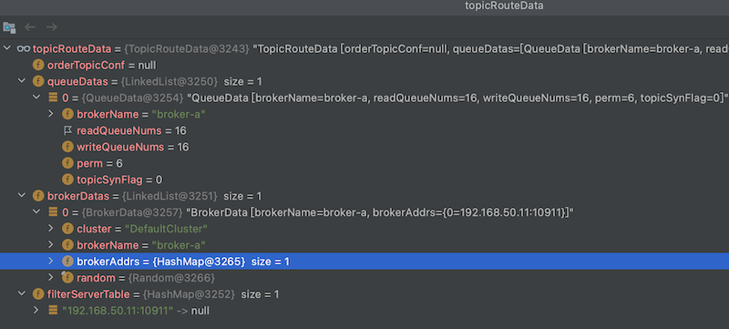

# Producer

新手在使用第一次使用 RocketMQ 进行发送消息的时候，经常会遇到 `No route info of this topic: XXX`错误,如果去搜索解决方案，
一般的建议是 1.开启自动创建 Topic 2.手动创建Topic 之后再发送消息即可。而这个其中的原因是由于`Topic`的路由机制导致的。

而了解这个问题的深层的原因需要从`RocketMQ`的`Producer`消息发送入手。

## 路由信息

首先看下，为什么需要路由信息。如下图：


RocketMQ 是支持集群的，如果存在多个Borker1,Borker2。那么`Producer`在发送消息的时候是如何把`Msg`平均的发送到每一个`Borker`中是一个需要解决的问题。
而`RocketMQ`就是通过引入`路由`这个东西来解决的。在引入路由之后，再通过 MessageQueue 来确定消息到底发送到哪个 Queue 中。而 Queue 一般都是平均的分配给
Broker的，最终可以达到消息平均分布在Broker中的目的。

## Msg 的发送

Producer 发送消息的前端是需要确定 queueId 确定了QueueId 也就确定了，消息最终会发送到哪个 Broker 中。
而确定 QueueId 是最复杂的流程。确定QueueId 需要3个角色的参与。Producer，NameServer，Broker 3个角色。

下面分别说明3个角色的各自的作用：

__NameServer 端：__

1. NameServer 启动,等待Borker的注册

__Broker 端：__

1. Broker 启动
2. 启动之后，注册自己到 NameServer

__Producer 端：__

1. 启动 Producer
2. 发送消息时，从 NameServer 获取路由信息
3. 获取路由信息成功，发送消息

`MQClientInstance#topicRouteData2TopicPublishInfo` 方法把 `TopicRouteData` 转化成 `TopicPublishInfo`（里面维护了 MessageQueue）

TopicConfig


TopicRouteData



`TopicPublishInfo`

```java
public class TopicPublishInfo {
    private boolean orderTopic = false;
    private boolean haveTopicRouterInfo = false;
    private List<MessageQueue> messageQueueList = new ArrayList<MessageQueue>();
    private volatile ThreadLocalIndex sendWhichQueue = new ThreadLocalIndex();
    private TopicRouteData topicRouteData;
}
```

## SendResult

```java
public class SendResult {
    private SendStatus sendStatus;
    private String msgId;
    private MessageQueue messageQueue;
    private long queueOffset;
    private String transactionId;
    private String offsetMsgId;
    private String regionId;
    private boolean traceOn = true;
}

public enum SendStatus {
    SEND_OK,
    FLUSH_DISK_TIMEOUT,
    FLUSH_SLAVE_TIMEOUT,
    SLAVE_NOT_AVAILABLE,
}
```

## DefaultMQProducer

```java
public class DefaultMQProducer extends ClientConfig implements MQProducer {
// ...
}
```

## MessageQueue

`queueId` 的获取

```java
// 选择 MessageQueue  DefaultMQProducerImpl#selectOneMessageQueue
MessageQueue mqSelected = this.selectOneMessageQueue(topicPublishInfo, lastBrokerName);
mq = mqSelected;

// 发消息 DefaultMQProducerImpl#sendDefaultImpl
sendResult = this.sendKernelImpl(msg, mq, communicationMode, sendCallback, topicPublishInfo, timeout - costTime);

// ... DefaultMQProducerImpl#sendKernelImpl
SendMessageRequestHeader requestHeader = new SendMessageRequestHeader();
// get QueueId
requestHeader.setQueueId(mq.getQueueId());
```
