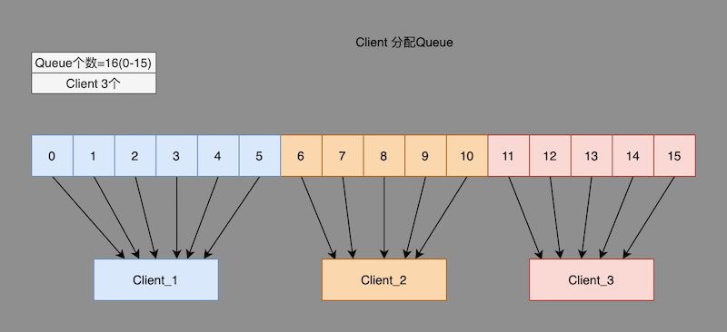

# rebalance

RocketMQ 中重平衡的实现逻辑。重平衡的主要目的是实现多个`Consumer`之间负载均衡。在`Consumer`上线和下线的时候，都会触发重平衡。

重平衡的主要类是 `RebalanceImpl`

下面用一张图来说明`重平衡`的作用：



`重平衡` 的作用是解决多个Consumer之间如何平均的分配Queue，从而达到负载均衡的目的。

具体的说明可以参考 [RocketMQ 消费端的实现](rocketmq-consumer.md)

## doRebalance

```java
// doRebalance 核心方法
public void doRebalance(final boolean isOrder) {
    Map<String, SubscriptionData> subTable = this.getSubscriptionInner();
    if (subTable != null) {
        for (final Map.Entry<String, SubscriptionData> entry : subTable.entrySet()) {
            final String topic = entry.getKey();
            try {
                this.rebalanceByTopic(topic, isOrder);
            } catch (Throwable e) {
                if (!topic.startsWith(MixAll.RETRY_GROUP_TOPIC_PREFIX)) {
                    log.warn("rebalanceByTopic Exception", e);
                }
            }
        }
    }
    this.truncateMessageQueueNotMyTopic();
}
```

## rebalanceByTopic

下面是执行`重平衡`的核心逻辑

```java
// RebalanceImpl#rebalanceByTopic
private void rebalanceByTopic(final String topic, final boolean isOrder) {
    switch (messageModel) {
        case BROADCASTING: {
            // ...
            break;
        }
        case CLUSTERING: {
            // 获取 MessageQueue 列表(mqSet)和所有的Consume(cidAll)列表
            Set<MessageQueue> mqSet = this.topicSubscribeInfoTable.get(topic);
            List<String> cidAll = this.mQClientFactory.findConsumerIdList(topic, consumerGroup);
           
            if (mqSet != null && cidAll != null) {
                List<MessageQueue> mqAll = new ArrayList<MessageQueue>();
                mqAll.addAll(mqSet);
                // 排序，十分主要
                Collections.sort(mqAll);
                Collections.sort(cidAll);
                // 获取分配策略
                AllocateMessageQueueStrategy strategy = this.allocateMessageQueueStrategy;
                List<MessageQueue> allocateResult = null;
                // 按照分配策略，给每个Consumer分配MessageQueue
                allocateResult = strategy.allocate(
                    this.consumerGroup,
                    this.mQClientFactory.getClientId(),
                    mqAll,
                    cidAll);
                Set<MessageQueue> allocateResultSet = new HashSet<MessageQueue>();
                if (allocateResult != null) {
                    allocateResultSet.addAll(allocateResult);
                }
                // 更新 ProcessQueue
                boolean changed = this.updateProcessQueueTableInRebalance(topic, allocateResultSet, isOrder);
                if (changed) {
                    // 
                    this.messageQueueChanged(topic, mqSet, allocateResultSet);
                }
            }
            break;
        }
        default:
            break;
    }
}
```

## 实现自定义的重平衡策略

首先，消息的创建需要 `DefaultMQPushConsumer` 类实例，而此类的实例构造方法提供了实现 `AllocateMessageQueueStrategy`

```java
// 无参的构造，分配策略默认实现类是 AllocateMessageQueueAveragely
public DefaultMQPushConsumer(final String consumerGroup) {
    this(null, consumerGroup, null, new AllocateMessageQueueAveragely());
}
// 此构造方法提供了自定义 AllocateMessageQueueStrategy 分配策略的入口。
public DefaultMQPushConsumer(final String consumerGroup, RPCHook rpcHook,
    AllocateMessageQueueStrategy allocateMessageQueueStrategy) {
    this(null, consumerGroup, rpcHook, allocateMessageQueueStrategy);
}
```

## Links

- [RocketMQ Rebalance](https://cloud.tencent.com/developer/article/1554950)
