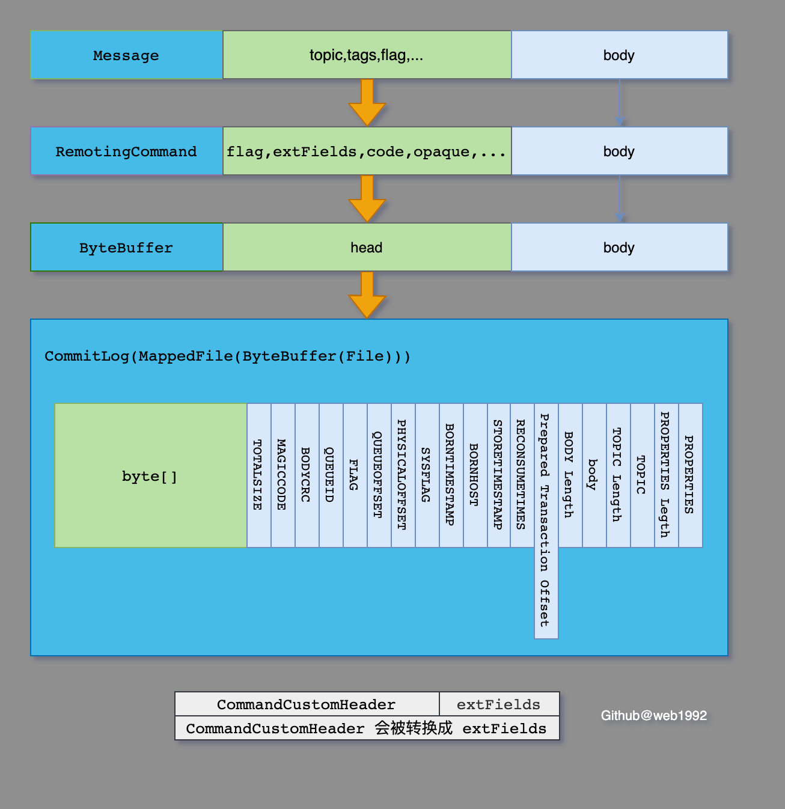
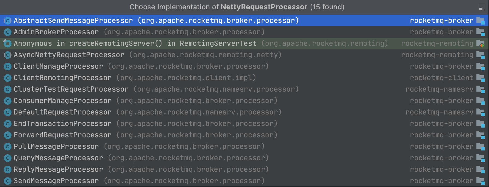

# RemotingCommand

RockemtMQ 的 `Client`(Consumer,Producer) 与 `Server`(Broker) 的交互都是使用`RemotingCommand`对象进行序列化和反序列化的。

先看图(Message到ByteBuffer的转化过程)：



```java
// msg -> SendMessageRequestHeader
// 代码位置 DefaultMQProducerImpl#sendKernelImpl:781
final Message msg=null;

SendMessageRequestHeader requestHeader = new SendMessageRequestHeader();
requestHeader.setProducerGroup(this.defaultMQProducer.getProducerGroup());
requestHeader.setTopic(msg.getTopic());
requestHeader.setDefaultTopic(this.defaultMQProducer.getCreateTopicKey());
requestHeader.setDefaultTopicQueueNums(this.defaultMQProducer.getDefaultTopicQueueNums());
requestHeader.setQueueId(mq.getQueueId());
requestHeader.setSysFlag(sysFlag);
requestHeader.setBornTimestamp(System.currentTimeMillis());
requestHeader.setFlag(msg.getFlag());
requestHeader.setProperties(MessageDecoder.messageProperties2String(msg.getProperties()));
requestHeader.setReconsumeTimes(0);
requestHeader.setUnitMode(this.isUnitMode());
requestHeader.setBatch(msg instanceof MessageBatch);

// SendMessageRequestHeader -> RemotingCommand
// 代码位置 MQClientAPIImpl#sendMessage:454
RemotingCommand request = null;
SendMessageRequestHeaderV2 requestHeaderV2 = SendMessageRequestHeaderV2.createSendMessageRequestHeaderV2(requestHeader);
                request = RemotingCommand.createRequestCommand(RequestCode.SEND_REPLY_MESSAGE_V2, requestHeaderV2);
```

> Tips: idea 中使用这方式`DefaultMQProducerImpl#sendKernelImpl:781`可以快速定位到指定的行,如下图：


`MAC:command+o, Windows:ctrl+o`

## CommandCustomHeader

`CommandCustomHeader` 是`RemotingCommand`消息体中消息`Head`的包装

```java
// Demo 例子
public RemotingCommand processRequest(ChannelHandlerContext ctx, RemotingCommand request) throws
    RemotingCommandException {
    final RemotingCommand response = RemotingCommand.createResponseCommand(null);
    // 从request 中解码出RequestHeader 
    final EndTransactionRequestHeader requestHeader =
        (EndTransactionRequestHeader)request.decodeCommandCustomHeader(EndTransactionRequestHeader.class);
}
```

常用的 CommandCustomHeader

| RequestCode           | Request Header              | Respone Header            | 描述               |
| --------------------- | --------------------------- | ------------------------- | ------------------ |
| SEND_REPLY_MESSAGE_V2 | SendMessageRequestHeaderV2  | SendMessageResponseHeader | 发消息的请求和响应 |
| SEND_REPLY_MESSAGE    | SendMessageRequestHeader    | SendMessageResponseHeader | 发消息的请求和响应 |
| SEND_MESSAGE          | SendMessageRequestHeader    | --                        | 没有 Reply的消息   |
| PULL_MESSAGE          | PullMessageRequestHeader    | PullMessageResponseHeader | 拉消息的请求和响应 |
| END_TRANSACTION       | EndTransactionRequestHeader | --                        | 事物结束消息       |

## RequestCode

常见的RequestCode

- SEND_BATCH_MESSAGE
- SEND_REPLY_MESSAGE_V2
- SEND_REPLY_MESSAGE
- PULL_MESSAGE

## RequestCode And NettyRequestProcessor

一种 `NettyRequestProcessor` 会处理一种或者多种RequestCode。是所有走RPC的入口。

```java
// 注册 RequestCode 与RequestProcessor 的关系
this.remotingServer.registerProcessor(RequestCode.SEND_MESSAGE, sendProcessor, this.sendMessageExecutor);
// 最终会被放入到 processorTable 中
public void registerProcessor(int requestCode, NettyRequestProcessor processor, ExecutorService executor) {
    ExecutorService executorThis = executor;
    if (null == executor) {
        executorThis = this.publicExecutor;
    }
    Pair<NettyRequestProcessor, ExecutorService> pair = new Pair<NettyRequestProcessor, ExecutorService>(processor, executorThis);
    this.processorTable.put(requestCode, pair);
}
```

`NettyRequestProcessor` 最终的使用：

```java
// org.apache.rocketmq.remoting.netty.NettyRemotingServer.NettyServerHandler -> NettyRemotingAbstract
// NettyRemotingAbstract
public void processRequestCommand(final ChannelHandlerContext ctx, final RemotingCommand cmd) {
        // 从processorTable 根据code 也就是RequestCode 取到NettyRequestProcessor
        final Pair<NettyRequestProcessor, ExecutorService> matched = this.processorTable.get(cmd.getCode());
}
```

`NettyRequestProcessor` 的实现类


