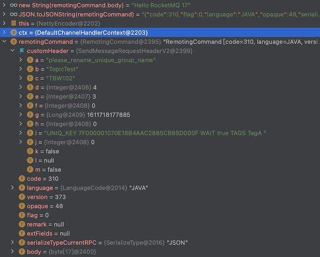
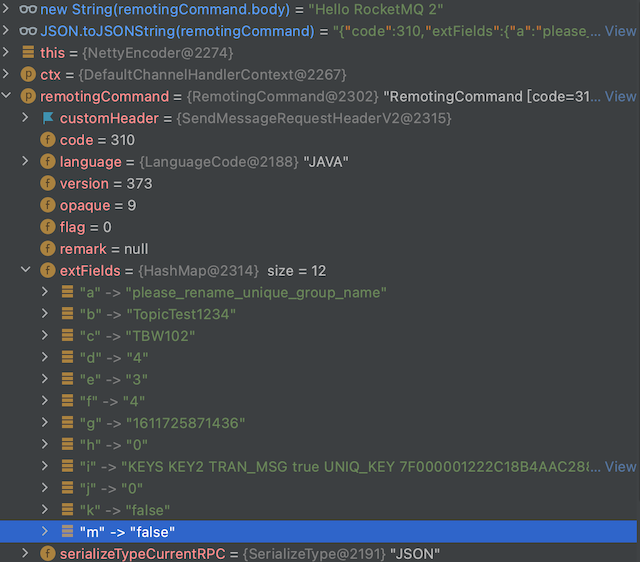

# Serialize

RocketMQ 序列化

- [Serialize](#serialize)
  - [RocketMQ 序列化协议](#rocketmq-序列化协议)
  - [RemotingCommand 的 Head 和 Body](#remotingcommand-的-head-和-body)
  - [flag 字段](#flag-字段)
  - [code 字段](#code-字段)
  - [RemotingCommand Decode](#remotingcommand-decode)
  - [RemotingCommand Encode](#remotingcommand-encode)
  - [CommandCustomHeader and extFields](#commandcustomheader-and-extfields)
  - [CommandCustomHeader](#commandcustomheader)
  - [Links](#links)

可以解答的疑惑：

- RocketMQ 序列化协议的设计结构
- RocketMQ 支持的序列化协议是什么
- RocketMQ 序列化协议设计中的小技巧
- RocketMQ group,topic,tags,keys 等信息是怎么进行序列化传输的
- RocketMQ 事务消息和普通消息，在序列化中的区别（怎么区分是事务消息，非事务消息）

一个消息从创建到发送到MQ，都经历了什么？如下图（只是列出了Msg的创建到存储，不包含消费流程，大量细节被省略）：


我们发送的 `Message` 对象会被转化成 `RemotingCommand` 序列化，进行网络传输。`RocketMQ` 的序列化的核心对象就是 `RemotingCommand`

`RemotingCommand` 在到达 `RocketMQ` 之后，会被转化成 `MessageExtBrokerInner` 进行持久化存储，也就是存储到文件。

## RocketMQ 序列化协议

序列化协议，简单来讲就是`制定`了 **byte[] 字节转化成 Java 对象和 Java 对象转化成 byte[]** 的方式

`RocketMQ` 序列化协议规定了进行网络通信的 `byte[]` 数据格式,协议由`head` + `body` 组成的变长消息(`head`也是变长的)，支持扩展字段。

`Head` 支持 `JSON` 和 `ROCKETMQ` 两种序列化方式,而 `body` 永远是 `byte[]`

```java
// ROCKETMQ 支持的序列化方式
// org.apache.rocketmq.remoting.protocol.SerializeType
JSON((byte) 0),
ROCKETMQ((byte) 1);
```

## RemotingCommand 的 Head 和 Body

序列化协议的主要实现类是 `RemotingCommand`，由 head + body 组成。代码片段如下：

```java
// org.apache.rocketmq.remoting.protocol.RemotingCommand
// head
private int code;
private LanguageCode language = LanguageCode.JAVA;
private int version = 0;
private int opaque = requestId.getAndIncrement();
private int flag = 0;
private String remark;
private HashMap<String, String> extFields;
// transient 修饰 是避免 被 Josn 解析
private transient CommandCustomHeader customHeader;
private SerializeType serializeTypeCurrentRPC = serializeTypeConfigInThisServer;
// body 
// transient 修饰 是避免 被 Josn 解析
private transient byte[] body;
```

> `RemotingCommand` 字段说明：

| 字段                    | 描述                                                                                                                                                            |
| ----------------------- | --------------------------------------------------------------------------------------------------------------------------------------------------------------- |
| code                    | RequestCode，ResponseCode 可作做为 心跳消息，普通消息，不同消息版本 等等，之间的区分标记记，在响应的时候，可以表示请求的成功或者失败（RemotingSysResponseCode） |
| language                | 使用的开发语言，如：java,c++,golang                                                                                                                             |
| version                 | 消息版本                                                                                                                                                        |
| opaque                  | 消息的 seq num (消息的序号，也是常见的字段，用来回写 response)                                                                                                  |
| flag                    | RPC 的类型 REQUEST/RESPONSE (RemotingCommandType) 还用来区分是：请求响应模式 或者 RPC_ONEWAY                                                                    |
| remark                  | 备注                                                                                                                                                            |
| extFields               | 扩展字段，基本每一种 RPC 通信都会有的字段，用来传输自定义信息(但是 RocketMQ 却是用来传输 customHeader 的)                                                       |
| customHeader            | 消息head的格式，种类有很多个(code 不同，对应的customHeader 也不同),包含了消息的 group,topic,tags 等信息，常用的有 SendMessageRequestHeaderV2                    |
| serializeTypeCurrentRPC | 序列化的格式，支持 `json` 和 `ROCKETMQ`                                                                                                                         |
| body                    | 消息体，例如发送 `Hello` 到某一个 tpoic 里面只包含 `Hello` 信息，不包含tpoic,tag 信息                                                                           |

## flag 字段

`flag` 是 bit 位的经典使用方式。用不同的 bit 位来标示不同的状态，Java 中的 [`SelectionKey`](https://github.com/web1992/read/blob/main/java/nio-selection-key.md) 和 `AbstractQueuedSynchronizer`的`state` 字段都采用了此方式。

```java
// ...
int flag=0;
int RPC_TYPE = 0;
int RPC_ONEWAY = 1;

// flag 的赋值
public void markOnewayRPC() {
    int bits = 1 << RPC_ONEWAY;
    this.flag |= bits;
}
@JSONField(serialize = false)
public boolean isOnewayRPC() {
    int bits = 1 << RPC_ONEWAY;
    return (this.flag & bits) == bits;
}
// flag 的使用
@JSONField(serialize = false)
public RemotingCommandType getType() {
    if (this.isResponseType()) {
        return RemotingCommandType.RESPONSE_COMMAND;
    }
    return RemotingCommandType.REQUEST_COMMAND;
}
@JSONField(serialize = false)
public boolean isResponseType() {
    int bits = 1 << RPC_TYPE;
    return (this.flag & bits) == bits;
}
```

## code 字段

`code` 在`发送请求`的时候是用来区分消息的类型的，根据不同的类型会有不同的处理

- RequestCode 发送的消息类型

```java
// 常用的code
public static final int SEND_MESSAGE_V2 = 310;
```

- ResponseCode 响应的消息类型

`code` 在处理响应的时候，用来检测响应的成功、失败等其他状态（响应的code 在 RemotingSysResponseCode 中）

因此 `code` 在`请求`和`响应`的时候含义是不同的，这样设计的目的是为了`精简` RPC 协议（少一个字段，少传输byte数据），也是常用的设计方式。

## RemotingCommand Decode

**反序列化** (解码)：`byte[]` 转化成 `RemotingCommand` 对象

入口在 `org.apache.rocketmq.remoting.netty.NettyDecoder`

> 下面的代码片段需要有`IO`操作的知识。比如知道如何把`java`中的`int`转化成`byte[]`,把`byte[]`转成`int`
> 其他类型的`shot`,`long`,`double`,`String`都是类似的原理。
> 了解 `Big-Endian` 和 `Little-endian`

```java
// NettyDecoder#decode
//      -> RemotingCommand#decode -> headerDecode
//          -> RocketMQSerializable#rocketMQProtocolDecode
// RocketMQSerializable#rocketMQProtocolDecode
// 下面是 head 的解析过程
public static RemotingCommand rocketMQProtocolDecode(final byte[] headerArray) {
    RemotingCommand cmd = new RemotingCommand();
    ByteBuffer headerBuffer = ByteBuffer.wrap(headerArray);
    // int code(~32767)
    cmd.setCode(headerBuffer.getShort());
    // LanguageCode language
    cmd.setLanguage(LanguageCode.valueOf(headerBuffer.get()));
    // int version(~32767)
    cmd.setVersion(headerBuffer.getShort());
    // int opaque
    cmd.setOpaque(headerBuffer.getInt());
    // int flag
    cmd.setFlag(headerBuffer.getInt());
    // String remark
    int remarkLength = headerBuffer.getInt();
    if (remarkLength > 0) {
        byte[] remarkContent = new byte[remarkLength];
        headerBuffer.get(remarkContent);
        cmd.setRemark(new String(remarkContent, CHARSET_UTF8));
    }
    // HashMap<String, String> extFields
    int extFieldsLength = headerBuffer.getInt();
    if (extFieldsLength > 0) {
        byte[] extFieldsBytes = new byte[extFieldsLength];
        headerBuffer.get(extFieldsBytes);
        cmd.setExtFields(mapDeserialize(extFieldsBytes));
    }
    return cmd;
}
// RemotingCommand#decode
// head 解析之后的 body 解析
public static RemotingCommand decode(final ByteBuffer byteBuffer) {
    int length = byteBuffer.limit();
    int oriHeaderLen = byteBuffer.getInt();
    int headerLength = getHeaderLength(oriHeaderLen);
    byte[] headerData = new byte[headerLength];
    byteBuffer.get(headerData);
    RemotingCommand cmd = headerDecode(headerData, getProtocolType(oriHeaderLen));
    int bodyLength = length - 4 - headerLength;
    byte[] bodyData = null;
    if (bodyLength > 0) {
        bodyData = new byte[bodyLength];
        byteBuffer.get(bodyData);
    }
    cmd.body = bodyData;
    return cmd;
}
```

## RemotingCommand Encode

**序列化** (编码)：`RemotingCommand` 转化成 `byte[]`对象

入口在 `org.apache.rocketmq.remoting.netty.NettyEncoder`

```java
// RemotingCommand#encodeHeader
//      -> RemotingCommand#headerEncode
//          -> RocketMQSerializable.rocketMQProtocolEncode
// NettyEncoder 的代码片段
// 先写 head 再写 body
ByteBuffer header = remotingCommand.encodeHeader();
out.writeBytes(header);// 写 head
byte[] body = remotingCommand.getBody();
if (body != null) {
    out.writeBytes(body);// 写 body
}
```

下面是 head 转成 byte[]

```java
// head 转成 byte[]
public static byte[] rocketMQProtocolEncode(RemotingCommand cmd) {
       // String remark
       byte[] remarkBytes = null;
       int remarkLen = 0;
       if (cmd.getRemark() != null && cmd.getRemark().length() > 0) {
           remarkBytes = cmd.getRemark().getBytes(CHARSET_UTF8);
           remarkLen = remarkBytes.length;
       }
       // HashMap<String, String> extFields
       byte[] extFieldsBytes = null;
       int extLen = 0;
       if (cmd.getExtFields() != null && !cmd.getExtFields().isEmpty()) {
           extFieldsBytes = mapSerialize(cmd.getExtFields());
           extLen = extFieldsBytes.length;
       }
       int totalLen = calTotalLen(remarkLen, extLen);
       ByteBuffer headerBuffer = ByteBuffer.allocate(totalLen);
       // int code(~32767)
       headerBuffer.putShort((short) cmd.getCode());
       // LanguageCode language
       headerBuffer.put(cmd.getLanguage().getCode());
       // int version(~32767)
       headerBuffer.putShort((short) cmd.getVersion());
       // int opaque
       headerBuffer.putInt(cmd.getOpaque());
       // int flag
       headerBuffer.putInt(cmd.getFlag());
       // String remark
       if (remarkBytes != null) {
           headerBuffer.putInt(remarkBytes.length);
           headerBuffer.put(remarkBytes);
       } else {
           headerBuffer.putInt(0);
       }
       // HashMap<String, String> extFields;
       if (extFieldsBytes != null) {
           headerBuffer.putInt(extFieldsBytes.length);
           headerBuffer.put(extFieldsBytes);
       } else {
           headerBuffer.putInt(0);
       }
       return headerBuffer.array();
   }
```

## CommandCustomHeader and extFields

上面提到过 `customHeader` 是被 `transient` 修饰的，不会被 `JSON` 序列化

而下面的方法就是把 `customHeader` 转换成 `extFields` （从而进行序列化传输）的代码片段

```java
// RemotingCommand#makeCustomHeaderToNet 方法
// 把 CommandCustomHeader 对象 转换成 extFields Map

// RemotingCommand#decodeCommandCustomHeader 方法
// 把 extFields 转成 CommandCustomHeader 对象,代码此处就不在列举了
public void makeCustomHeaderToNet() {
    if (this.customHeader != null) {
        Field[] fields = getClazzFields(customHeader.getClass());
        if (null == this.extFields) {
            this.extFields = new HashMap<String, String>();
        }
        for (Field field : fields) {
            if (!Modifier.isStatic(field.getModifiers())) {
                String name = field.getName();
                if (!name.startsWith("this")) {
                    Object value = null;
                    try {
                        field.setAccessible(true);
                        value = field.get(this.customHeader);
                    } catch (Exception e) {
                        log.error("Failed to access field [{}]", name, e);
                    }
                    if (value != null) {
                        this.extFields.put(name, value.toString());
                    }
                }
            }
        }
    }
}
```

## CommandCustomHeader

`CommandCustomHeader` 的主要作用是存储消息和转化的 `topic` `tags` `是否事物消息` 等信息。

常用的消息 Head

- CheckTransactionStateRequestHeader 事务检查
- CheckTransactionStateResponseHeader
- EndTransactionRequestHeader 结束事务
- EndTransactionResponseHeader
- SendMessageRequestHeaderV2

最常用的消息 `org.apache.rocketmq.common.protocol.header.SendMessageRequestHeaderV2`

```java
// SendMessageRequestHeaderV2
@CFNotNull
private String a; // producerGroup;
@CFNotNull
private String b; // topic;
@CFNotNull
private String c; // defaultTopic;
@CFNotNull
private Integer d; // defaultTopicQueueNums;
@CFNotNull
private Integer e; // queueId;
@CFNotNull
private Integer f; // sysFlag;
@CFNotNull
private Long g; // bornTimestamp;
@CFNotNull
private Integer h; // flag;
@CFNullable
private String i; // properties;
@CFNullable
private Integer j; // reconsumeTimes;
@CFNullable
private boolean k; // unitMode = false;
private Integer l; // consumeRetryTimes
@CFNullable
private boolean m; //batch
```

发送普通消息的截图:



事务消息:



**json 形式**

```json
{
  "code": 310,
  "extFields": {
    "a": "please_rename_unique_group_name",
    "b": "TopicTest1234",
    "c": "TBW102",
    "d": "4",
    "e": "3",
    "f": "4",
    "g": "1611725871436",
    "h": "0",
    "i": "KEYS  KEY2  TRAN_MSG  true  UNIQ_KEY  7F000001222C18B4AAC288D21D4B0001  WAIT  true  PGROUP  please_rename_unique_group_name  TAGS  TagC  ",
    "j": "0",
    "k": "false",
    "m": "false"
  },
  "flag": 0,
  "language": "JAVA",
  "opaque": 9,
  "serializeTypeCurrentRPC": "JSON",
  "version": 373
}
```

上面的 json 中的 i 对应的是 含义是 `properties` 因此可以知道 RocketMQ 的 group,topic,tags,keys 都是被包装成 `properties` 进行传输的

如果是事务消息，则 `properties` 中会有 `TRAN_MSG  true`

## Links

- [https://www.cnblogs.com/NaughtyCat/p/little-endian-and-big-endian-based-on-bytebuffer-in-java.html](https://www.cnblogs.com/NaughtyCat/p/little-endian-and-big-endian-based-on-bytebuffer-in-java.html)
