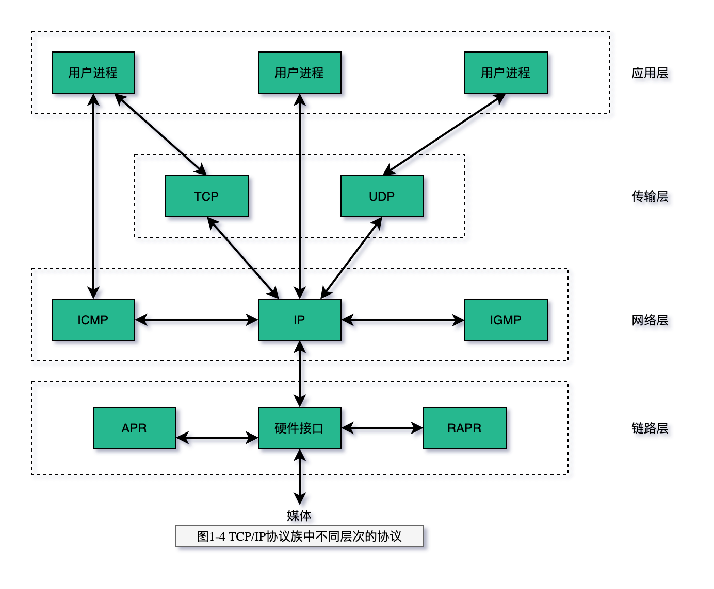
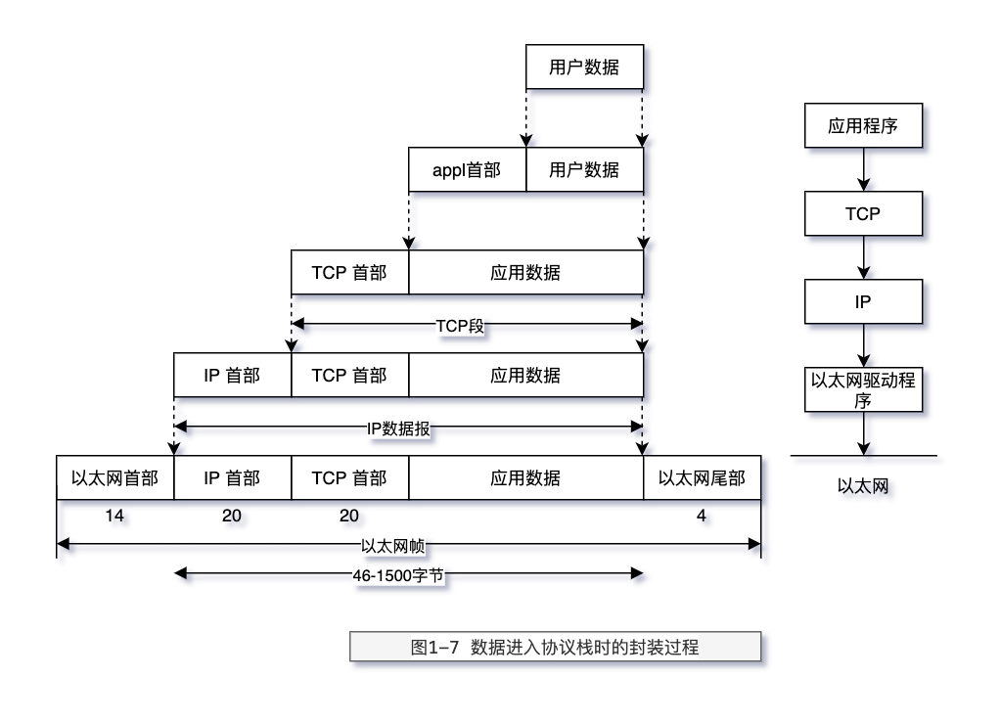

# 概述

核心：需要知道`分层`和`分用`的目的，让各层只关注自己的事情。

关键字：

- 分层
- TCP/IP分层
- 封装
- 分用 Demultiplexing
- 端口号
- RFC

连接网络的另一个途径是使用网桥。网桥是在`链路层`上对网络进行互连，而路由器则是在`网络层`上对网络进行互连。
网桥使得多个局域网（LAN Local Area Network）组合在一起，这样对上层来说就好像是一个局域网。

> 图1-1 TCP/IP协议族的四个层次

> 图1-2 局域网上运行FTP的两台主机

> 图1-3 通过路由器连接的两个网络

> 图1-4 TCP/IP协议族中不同层次的协议

> 图1-5 五类互联网地址

> 图1-6 各类IP地址的范围

> 图1-7 数据进入协议栈时的封装过程

