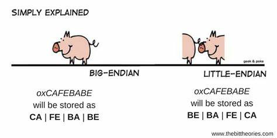

# IP 网际协议

IP 是 TCP/IP 协议族中最为核心的协议。所有的 TCP、UDP、ICMP 及 IGMP 数据都以 IP 数据报格式传输。

> 核心：

- IP 首部
- IP 路由选择
- 子网寻址
- 子网掩码

## 特点

不可靠（unreliable）的意思是它不能保证 IP 数据报能成功地到达目的地。IP 仅提供最好的传输服务。
如果发生某种错误时，如某个路由器暂时用完了缓冲区，IP 有一个简单的错误处理算法：丢弃该数据报，然后发送 ICMP 消息报给信源端。
任何要求的可靠性必须由上层来提供（如 TCP）。

无连接（connectionless）这个术语的意思是 IP 并不维护任何关于后续数据报的状态信息。
每个数据报的处理是相互独立的。这也说明，IP 数据报可以不按发送顺序接收。如果一信源向相同的信宿发送两个连续的数据报（先是 A，然后是 B），
每个数据报都是独立地进行路由选择，可能选择不同的路线，因此 B 可能在 A 到达之前先到达。

> 了解的名词

- 网络字节序
- IP 层路由表
- IP TTL (time to live)
- 无类别的域间路由选择 CIDR（Classless Interdomain Routing）
- IP 路由选择
- 子网编址
- 子网寻址
- 子网掩码 也是一个 32 位二进制数字，它的网络部分全部为 1，主机部分全部为 0。
- ifconfig 命令
- netstat 命令

## IP 首部

> 图 3-1 IP 数据报格式及首部中的各字段


### 4 位版本

目前的协议版本号是 4，因此 IP 有时也称作 IPv4。`首部长度`指的是首部占`32bit字的数目`，`包括任何选项`。
由于它是一个 4 比特字段，因此首部最长（包括任何选项）为 60 个字节。

### 4 首部长度

> `首部长度`指的是首部占`32bit字的数目`

2 的 4 次方=16-1=15(0-15)，总字节=32\*15=480 bit,480/8=60 字节。因此 IP 数据报文的总长度是 60 字节(480bit)。

IP 首部占用 20\*8=160bit, 480-160=320, 320/8=40 字节(选项)

### 8 位服务类型

服务类型（TOS）字段包括一个 3bit 的优先权子字段（现在已被忽略），4bit 的 TOS 子字
段和 1bit 未用位但必须置 0。4bit 的 TOS 分别代表：最小时延、最大吞吐量、最高可靠性和最
小费用。4bit 中只能置其中 1bit。如果所有 4bit 均为 0，那么就意味着是一般服务。

### 16 位总长度

总长度字段是指整个 IP 数据报的长度，以字节为单位。利用首部长度字段和总长度字段，就可以知道 IP 数据报中数据内容的起始位置和长度。
由于该字段长 16 比特，所以 IP 数据报最长可达 65535 字节当数据报被分片时，该字段的值也随着变化。

### 16 位标示

标识字段唯一地标识主机发送的每一份数据报。通常每发送一份报文它的值就会加 1。

### 3 位标示

### 13 位偏倚

### 8 位生存时间

TTL（time-to-live）生存时间字段设置了数据报可以经过的最多路由器数。它指定了数据
报的生存时间。TTL 的初始值由源主机设置（通常为 32 或 64），一旦经过一个处理它的路由器，
它的值就减去 1。当该字段的值为 0 时，数据报就被丢弃，并发送 ICMP 报文通知源主机。

### 8 位协议

由于 TCP、UDP、ICMP 和 IGMP 都要向 IP 传送数据，因此 IP 必须在生成的 IP 首部中加入某种标识，以表明数据属于哪一层。
为此，IP 在首部中存入一个长度为 8bit 的数值，称作协议域。1 表示为`ICMP`协议，2 表示为`IGMP`协议，6 表示为`TCP`协议，17 表示为`UDP`协议。

### 16 位首部校验和

为了计算一份数据报的 IP 检验和，首先把检验和字段置为 0。然后，对首部中每个 16bit进行二进制反码求和（整个首部看成是由一串 16bit 的字组成），结果存在检验和字段中。
当收到一份 IP 数据报后，同样对首部中每个 16bit 进行二进制反码的求和。由于接收方在计算过程中包含了发送方存在首部中的检验和，因此，如果首部在传输过程中没有发生任何差错，那么接收方计算的结果应该为全 1。如果结果不是全 1（即检验和错误），那么 IP 就丢弃收到的数据报。但是不生成差错报文，由上层去发现丢失的数据报并进行重传。

ICMP、IGMP、UDP 和 TCP 都采用相同的检验和算法，尽管 TCP 和 UDP 除了本身的首部和数据外，在 IP 首部中还包含不同的字段。

### 任选项

任选项是数据报中的一个可变长的可选信息。目前，这些任选项定义如下：

• 安全和处理限制（用于军事领域，详细内容参见 RFC1108[Kent1991]）
• 记录路径（让每个路由器都记下它的 IP 地址，见 7.3 节）
• 时间戳（让每个路由器都记下它的 IP 地址和时间，见 7.4 节）
• 宽松的源站选路（为数据报指定一系列必须经过的 IP 地址，见 8.5 节）
• 严格的源站选路（与宽松的源站选路类似，但是要求只能经过指定的这些地址，不能经过其他的地址）。

这些选项很少被使用，并非所有的主机和路由器都支持这些选项。
选项字段一直都是以 32bit 作为界限，在必要的时候插入值为 0 的填充字节。这样就保证
IP 首部始终是 32bit 的整数倍（这是首部长度字段所要求的）。

## 网络字节序

4 个字节的 32 bit 值以下面的次序传输：首先是 0 ～ 7 bit，其次 8 ～ 15 bit，然后 16 ～ 23 bit，最后是 24~31 bit。
这种传输次序称作 `big endian` 字节序。由于 TCP/IP 首部中所有的二进制整数在网络中传输时都要求以这种次序，因此它又称作网络字节序。
以其他形式存储二进制整数的机器，如`little endian`格式，则必须在传输数据之前把首部转换成网络字节序。



## IP 路由选择

从概念上说，IP 路由选择是简单的，特别对于主机来说。如果目的主机与源主机直接相连（如点对点链路）或都在一个共享网络上（以太网或令牌环网），
那么 IP 数据报就直接送到目的主机上。否则，主机把数据报发往一默认的路由器上，由路由器来转发该数据报。大多数的主机都是采用这种简单机制。

在一般的体制中，IP 可以从 TCP、UDP、ICMP 和 IGMP`接收`数据报（即在本地生成的数据报）并进行发送，
或者从一个网络接口接收数据报（待转发的数据报）并进行发送。IP 层在内存中有一个`路由表`。
当收到一份数据报并进行发送时，它都要对该表搜索一次。当数据报来自某个网络接口时，
IP 首先检查目的 IP 地址`是否为本机的IP地址`之一或者`IP广播地址`。
如果确实是这样，数据报就被送到由 IP 首部协议字段所指定的协议模块进行处理。如果数据报的目的不是这些地址，那么

-（1）如果 IP 层被设置为路由器的功能，那么就对数据报进行转发（也就是说，像下面对待发出的数据报一样处理）；否则
-（2）数据报被丢弃。路由表中的每一项都包含下面这些信息：

- 目的 IP 地址。它既可以是一个完整的主机地址，也可以是一个网络地址，由该表目中的标志字段来指定（如下所述）。
  主机地址有一个非 0 的主机号（[见图 1-5](./images/TCP-IP-1-5.png)），以指定某一特定的主机，
  而网络地址中的主机号为 0，以指定网络中的所有主机（如以太网，令牌环网）。

- 下一站（或下一跳）路由器（next-hoprouter）的 IP 地址，或者有直接连接的网络 IP 地
  址。下一站路由器是指一个在直接相连网络上的路由器，通过它可以转发数据报。下
  一站路由器不是最终的目的，但是它可以把传送给它的数据报转发到最终目的。

- 标志。其中一个标志指明目的 IP 地址是网络地址还是主机地址，另一个标志指明下一
  站路由器是否为真正的下一站路由器，还是一个直接相连的接口。

- 为数据报的传输指定一个网络接口

IP 路由选择主要完成以下这些功能： 
- 1)搜索路由表，寻找能与目的 IP 地址完全匹配的表目（网络号和主机号都要匹配）。如果找到，则把报文发送给该表目指定的下一站路由器或直接连接的网络接口（取决于标志字段的值）。 
- 2)搜索路由表，寻找能与目的网络号相匹配的表目。如果找到，则把报文发送给该表目指定的下一站路由器或直接连接的网络接口（取决于标志字段的值）。目的网络上的所有主机都可以通过这个表目来处置。例如，一个以太网上的所有主机都是通过这种表目进行寻径的。这种搜索网络的匹配方法必须考虑可能的子网掩码。
- 3)搜索路由表，寻找标为`默认（default）`的表目。如果找到，则把报文发送给该表目指定的下一站路由器。

如果上面这些步骤都没有成功，那么该数据报就不能被传送。如果不能传送的数据报来自本机，那么一般会向生成数据报的应用程序返回一个`主机不可达`或`网络不可达`的错误。

## 路由表

Linux 查看路由表的例子:

```sh
[root@web1992 ~]# route -n
Kernel IP routing table
Destination     Gateway         Genmask         Flags Metric Ref    Use Iface
0.0.0.0         172.19.175.253  0.0.0.0         UG    0      0        0 eth0
10.0.9.0        0.0.0.0         255.255.255.0   U     0      0        0 docker0
10.0.10.0       10.0.10.0       255.255.255.0   UG    0      0        0 flannel.1
10.0.15.0       10.0.15.0       255.255.255.0   UG    0      0        0 flannel.1
169.254.0.0     0.0.0.0         255.255.0.0     U     1002   0        0 eth0
172.19.160.0    0.0.0.0         255.255.240.0   U     0      0        0 eth0
```

## 子网寻址

许多管理员采用自然的划分方法，即把 B 类地址中留给主机的 16 bit 中的前 8 bit 作为子网
地址，后 8 bit 作为主机号。这样用点分十进制方法表示的 IP 地址就可以比较容易确定子网号。
但是，并不要求 A 类或 B 类地址的子网划分都要以字节为划分界限。

## 子网掩码

除了 IP 地址以外，主机还需要知道有多少比特用于子网号及多少比特用于主机号。这是
在引导过程中通过子网掩码来确定的。这个掩码是一个 32 bit 的值，其中值为 1 的比特留给`网络号`和`子网号`，为 0 的比特留给`主机号`。

根据 RFC950 定义，子网掩码是一个 32 位的 2 进制数， 其对应网络地址的所有位都置为 1，对应于主机地址的所有位都置为 0。

> 图 3-7 两种不同的 B 类地址子网掩码的例子


尽管 IP 地址一般以点分十进制方法表示，但是子网掩码却经常用十六进制来表示，特别
是当界限不是一个字节时，因为子网掩码是一个比特掩码。
给定 IP 地址和子网掩码以后，主机就可以确定 IP 数据报的目的是：

1. 本子网上的主机；
2. 本网络中其他子网中的主机；
3. 其他网络上的主机。

如果知道本机的 IP 地址，那么就知道它是否为 A 类、B 类或 C 类地址(从 IP 地址的高位可以得知)，
也就知道网络号和子网号之间的分界线。

## Links

- [https://datatracker.ietf.org/doc/html/rfc950 Subnetting](https://datatracker.ietf.org/doc/html/rfc950)
- [CIDR](https://www.cnblogs.com/way_testlife/archive/2010/10/05/1844399.html)
- [IP 地址段与子网掩码](https://cloud.tencent.com/developer/article/1392116)
- [INTERNET SUBNETS](https://datatracker.ietf.org/doc/html/rfc917)
- [IP 协议源码分析](https://mp.weixin.qq.com/s/zEeaqBlWsJ2sXfjKm_NaJA)
- [路由协议](https://mp.weixin.qq.com/s/ktahxXMDtDVufyigU49bXg)
- [大端和小端](https://www.cnblogs.com/luxiaoxun/archive/2012/09/05/2671697.html)