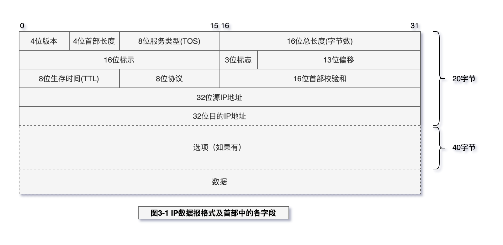

# IP 网际协议

- 网络字节序
- IP层路由表
- 无类别的域间路由选择 CIDR（Classless Interdomain Routing）
- IP路由选择
- 子网寻址
- 子网掩码 也是一个32位二进制数字，它的网络部分全部为1，主机部分全部为0。

> IP 首部

## 首部长度

> `首部长度`指的是首部占`32bit字的数目`

2的4次方=16-1=15(0-15)，总字节=32*15=480 bit,480/8=60字节。因此IP数据报文的总长度是60字节(480bit)。

IP首部占用20*8=160bit, 480-160=320, 320/8=40 字节

## 络字节序

4个字节的32 bit值以下面的次序传输：首先是0～7 bit，其次8～15 bit，然后16～23 bit，
最后是24~31 bit。这种传输次序称作big endian字节序。由于TCP/IP首部中所有的二进制整数
在网络中传输时都要求以这种次序，因此它又称作网络字节序。以其他形式存储二进制整数的机器，如`little endian`格式，则必须在传输数据之前把首部转换成网络字节序。

目前的协议版本号是4，因此IP有时也称作IPv4。3.10节将对一种新版的IP协议进行讨论。`首部长度`指的是首部占`32bit字的数目`，`包括任何选项`。由于它是一个4比特字段，因此首部最长为60个字节。

## Links

- [https://datatracker.ietf.org/doc/html/rfc950 Subnetting](https://datatracker.ietf.org/doc/html/rfc950)
- [CIDR](https://www.cnblogs.com/way_testlife/archive/2010/10/05/1844399.html)
- [IP地址段与子网掩码](https://cloud.tencent.com/developer/article/1392116)
