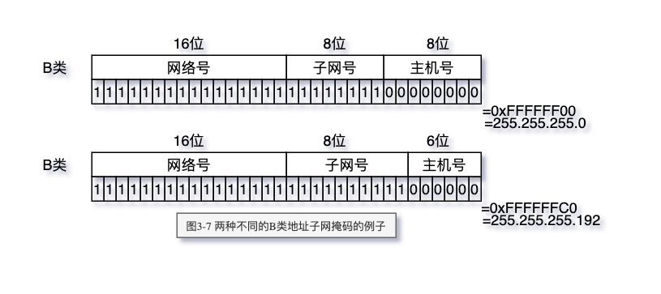

# IP 网际协议

IP是TCP/IP协议族中最为核心的协议。所有的TCP、UDP、ICMP及IGMP数据都以IP数据报格式传输。

> 核心：

- IP 首部
- IP 路由选择
- 子网寻址
- 子网掩码

## 特点

不可靠（unreliable）的意思是它不能保证IP数据报能成功地到达目的地。IP仅提供最好的传输服务。
如果发生某种错误时，如某个路由器暂时用完了缓冲区，IP有一个简单的错误处理算法：丢弃该数据报，然后发送ICMP消息报给信源端。
任何要求的可靠性必须由上层来提供（如TCP）。

无连接（connectionless）这个术语的意思是IP并不维护任何关于后续数据报的状态信息。
每个数据报的处理是相互独立的。这也说明，IP数据报可以不按发送顺序接收。如果一信源
向相同的信宿发送两个连续的数据报（先是A，然后是B），每个数据报都是独立地进行路由
选择，可能选择不同的路线，因此B可能在A到达之前先到达。

> 了解的名词

- 网络字节序
- IP层路由表
- IP TTL (time to live)
- 无类别的域间路由选择 CIDR（Classless Interdomain Routing）
- IP路由选择
- 子网编址
- 子网寻址
- 子网掩码 也是一个32位二进制数字，它的网络部分全部为1，主机部分全部为0。
- ifconfig 命令
- netstat 命令

## IP首部

> 图3-1 IP数据报格式及首部中的各字段


### 4位版本

目前的协议版本号是4，因此IP有时也称作IPv4。`首部长度`指的是首部占`32bit字的数目`，`包括任何选项`。
由于它是一个4比特字段，因此首部最长（包括任何选项）为60个字节。

### 4首部长度

> `首部长度`指的是首部占`32bit字的数目`

2的4次方=16-1=15(0-15)，总字节=32*15=480 bit,480/8=60字节。因此IP数据报文的总长度是60字节(480bit)。

IP首部占用20*8=160bit, 480-160=320, 320/8=40 字节(选项)

### 8位服务类型

服务类型（TOS）字段包括一个3bit的优先权子字段（现在已被忽略），4bit的TOS子字
段和1bit未用位但必须置0。4bit的TOS分别代表：最小时延、最大吞吐量、最高可靠性和最
小费用。4bit中只能置其中1bit。如果所有4bit均为0，那么就意味着是一般服务。

### 16位总长度

总长度字段是指整个IP数据报的长度，以字节为单位。利用首部长度字段和总长度字段，
就可以知道IP数据报中数据内容的起始位置和长度。由于该字段长16比特，所以IP数据报最
长可达65535字节当数据报被分片时，该字段的值也随着变化。

### 16 位标示

标识字段唯一地标识主机发送的每一份数据报。通常每发送一份报文它的值就会加1。

### 3位标示

### 13位偏倚

### 8位生存时间

TTL（time-to-live）生存时间字段设置了数据报可以经过的最多路由器数。它指定了数据
报的生存时间。TTL的初始值由源主机设置（通常为32或64），一旦经过一个处理它的路由器，
它的值就减去1。当该字段的值为0时，数据报就被丢弃，并发送ICMP报文通知源主机。

### 8位协议

由于TCP、UDP、ICMP和IGMP都要向IP传送数据，因此IP必须在生成的IP首部中加入某种标识，以表明数据属于哪一层。
为此，IP在首部中存入一个长度为8bit的数值，称作协议域。
1表示为`ICMP`协议，2表示为`IGMP`协议，6表示为`TCP`协议，17表示为`UDP`协议。

### 16位首部校验和

为了计算一份数据报的IP检验和，首先把检验和字段置为0。然后，对首部中每个16bit
进行二进制反码求和（整个首部看成是由一串16bit的字组成），结果存在检验和字段中。当
收到一份IP数据报后，同样对首部中每个16bit进行二进制反码的求和。由于接收方在计算过
程中包含了发送方存在首部中的检验和，因此，如果首部在传输过程中没有发生任何差错，
那么接收方计算的结果应该为全1。如果结果不是全1（即检验和错误），那么IP就丢弃收到的
数据报。但是不生成差错报文，由上层去发现丢失的数据报并进行重传。

CMP、IGMP、UDP和TCP都采用相同的检验和算法，尽管TCP和UDP除了本身的首部和
数据外，在IP首部中还包含不同的字段。

### 任选项

任选项是数据报中的一个可变长的可选信息。目前，这些任选项定义如下：

• 安全和处理限制（用于军事领域，详细内容参见RFC1108[Kent1991]）
• 记录路径（让每个路由器都记下它的IP地址，见7.3节）
• 时间戳（让每个路由器都记下它的IP地址和时间，见7.4节）
• 宽松的源站选路（为数据报指定一系列必须经过的IP地址，见8.5节）
• 严格的源站选路（与宽松的源站选路类似，但是要求只能经过指定的这些地址，不能经过其他的地址）。

这些选项很少被使用，并非所有的主机和路由器都支持这些选项。
选项字段一直都是以32bit作为界限，在必要的时候插入值为0的填充字节。这样就保证
IP首部始终是32bit的整数倍（这是首部长度字段所要求的）。

## 络字节序

4个字节的32 bit值以下面的次序传输：首先是0～7 bit，其次8～15 bit，然后16～23 bit，
最后是24~31 bit。这种传输次序称作big endian字节序。由于TCP/IP首部中所有的二进制整数
在网络中传输时都要求以这种次序，因此它又称作网络字节序。以其他形式存储二进制整数的机器，如`little endian`格式，
则必须在传输数据之前把首部转换成网络字节序。

## IP路由选择

从概念上说，IP路由选择是简单的，特别对于主机来说。如果目的主机与源主机直接相
连（如点对点链路）或都在一个共享网络上（以太网或令牌环网），那么IP数据报就直接送到
目的主机上。否则，主机把数据报发往一默认的路由器上，由路由器来转发该数据报。大多
数的主机都是采用这种简单机制。

在一般的体制中，IP可以从TCP、UDP、ICMP和IGMP`接收`数据报（即在本地生成的数据报）并进行发送，
或者从一个网络接口接收数据报（待转发的数据报）并进行发送。IP层在内存中有一个`路由表`。
当收到一份数据报并进行发送时，它都要对该表搜索一次。当数据报来自某个网络接口时，
IP首先检查目的IP地址`是否为本机的IP地址`之一或者`IP广播地址`。
如果确实是这样，数据报就被送到由IP首部协议字段所指定的协议模块进行处理。如果数据报的目的不是这些地址，那么

（1）如果IP层被设置为路由器的功能，那么就对数据报进行转发（也就是说，像下面对待发出的数据报一样处理）；否则
（2）数据报被丢弃。路由表中的每一项都包含下面这些信息：

- 目的IP地址。它既可以是一个完整的主机地址，也可以是一个网络地址，由该表目中的标志字段来指定（如下所述）。
主机地址有一个非0的主机号（[见图1-5](./images/TCP-IP-1-5.png)），以指定某一特定的主机，
而网络地址中的主机号为0，以指定网络中的所有主机（如以太网，令牌环网）。

- 下一站（或下一跳）路由器（next-hoprouter）的IP地址，或者有直接连接的网络IP地
址。下一站路由器是指一个在直接相连网络上的路由器，通过它可以转发数据报。下
一站路由器不是最终的目的，但是它可以把传送给它的数据报转发到最终目的。

- 标志。其中一个标志指明目的IP地址是网络地址还是主机地址，另一个标志指明下一
站路由器是否为真正的下一站路由器，还是一个直接相连的接口。

- 为数据报的传输指定一个网络接口

IP路由选择主要完成以下这些功能：
1)搜索路由表，寻找能与目的IP地址完全匹配的表目（网络号和主机号都要匹配）。如果
找到，则把报文发送给该表目指定的下一站路由器或直接连接的网络接口（取决于标志字段的值）。
2)搜索路由表，寻找能与目的网络号相匹配的表目。如果找到，则把报文发送给该表目
指定的下一站路由器或直接连接的网络接口（取决于标志字段的值）。目的网络上的所
有主机都可以通过这个表目来处置。例如，一个以太网上的所有主机都是通过这种表目进行寻径的。
这种搜索网络的匹配方法必须考虑可能的子网掩码。
3)搜索路由表，寻找标为`默认（default）`的表目。如果找到，则把报文发送给该表目指定的下一站路由器。

如果上面这些步骤都没有成功，那么该数据报就不能被传送。如果不能传送的数据报来自本机，那么一般会向生成数据报的应用程序返回一个`主机不可达`或`网络不可达`的错误。

## 路由表

Linux 查看路由表的例子:

```sh
[root@web1992 ~]# route -n
Kernel IP routing table
Destination     Gateway         Genmask         Flags Metric Ref    Use Iface
0.0.0.0         172.19.175.253  0.0.0.0         UG    0      0        0 eth0
10.0.9.0        0.0.0.0         255.255.255.0   U     0      0        0 docker0
10.0.10.0       10.0.10.0       255.255.255.0   UG    0      0        0 flannel.1
10.0.15.0       10.0.15.0       255.255.255.0   UG    0      0        0 flannel.1
169.254.0.0     0.0.0.0         255.255.0.0     U     1002   0        0 eth0
172.19.160.0    0.0.0.0         255.255.240.0   U     0      0        0 eth0
```

## 子网寻址

许多管理员采用自然的划分方法，即把B类地址中留给主机的16 bit中的前8 bit作为子网
地址，后8 bit作为主机号。这样用点分十进制方法表示的IP地址就可以比较容易确定子网号。
但是，并不要求A类或B类地址的子网划分都要以字节为划分界限。

## 子网掩码

除了IP地址以外，主机还需要知道有多少比特用于子网号及多少比特用于主机号。这是
在引导过程中通过子网掩码来确定的。这个掩码是一个32 bit的值，其中值为1的比特留给`网络号`和`子网号`，为0的比特留给`主机号`。

根据RFC950定义，子网掩码是一个32位的2进制数， 其对应网络地址的所有位都置为1，对应于主机地址的所有位都置为0。

> 图3-7 两种不同的B类地址子网掩码的例子



尽管IP地址一般以点分十进制方法表示，但是子网掩码却经常用十六进制来表示，特别
是当界限不是一个字节时，因为子网掩码是一个比特掩码。
给定IP地址和子网掩码以后，主机就可以确定IP数据报的目的是：
1. 本子网上的主机；
2. 本网络中其他子网中的主机；
3. 其他网络上的主机。

如果知道本机的IP地址，那么就知道它是否为A类、B类或C类地址(从IP地址的高位可以得知)，
也就知道网络号和子网号之间的分界线。

## Links

- [https://datatracker.ietf.org/doc/html/rfc950 Subnetting](https://datatracker.ietf.org/doc/html/rfc950)
- [CIDR](https://www.cnblogs.com/way_testlife/archive/2010/10/05/1844399.html)
- [IP地址段与子网掩码](https://cloud.tencent.com/developer/article/1392116)
- [INTERNET SUBNETS](https://datatracker.ietf.org/doc/html/rfc917)
