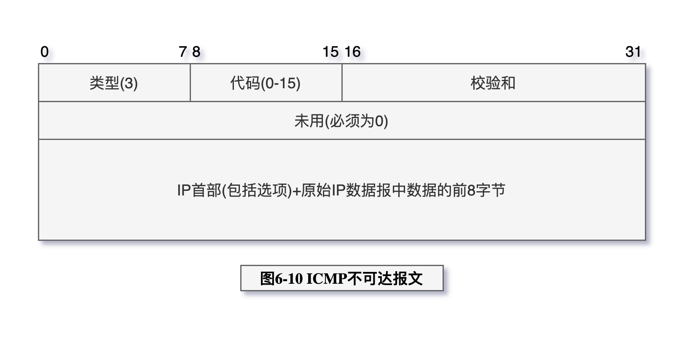

# ICMP：Internet 控制报文协议

ICMP 经常被认为是 IP 层的一个组成部分。它传递差错报文以及其他需要注意的信息。
ICMP 报文通常被 IP 层或更高层协议（TCP 或 UDP）使用。一些 ICMP 报文把差错报文返回给用户进程。

- 地址掩码请求和应答
- 时间戳请求和应答
- 不可达端口 ICMP 端口不可达差错
- IP 分片

一个重要的事实是包含在 UDP 首部中的内容是源端口号和目的端口号。就是由于目的端
口号（8888）才导致产生了 ICMP 端口不可达的差错报文。接收 ICMP 的系统可以根据源端口
号（2924）来把差错报文与某个特定的用户进程相关联（在本例中是 TFTP 客户程序）。
导致差错的数据报中的 IP 首部要被送回的原因是因为 IP 首部中包含了协议字段，使得
ICMP 可以知道如何解释后面的 8 个字节（在本例中是 UDP 首部）。如果我们来查看 TCP 首部
（图 17-2）,可以发现源端口和目的端口被包含在 TCP 首部的前 8 个字节中。

> 图 6-1 ICMP 封装在 IP 数据报内部

> 图 6-2 ICMP 报文

检验和字段覆盖整个 ICMP 报

> 6-9

> 6-10

## Links

- [https://www.rfc-editor.org/rfc/rfc792.txt](https://www.rfc-editor.org/rfc/rfc792.txt)
