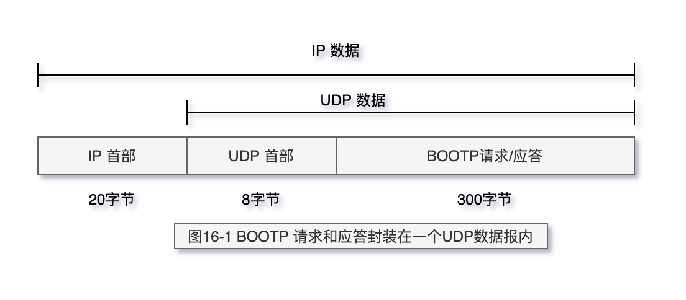

# BOOTP： 引导程序协议

在第 5 章我们介绍了一个无盘系统，它在不知道自身 IP 地址的情况下，在进行系统引导时能够通过 RARP 来获取它的 IP 地址。
然而使用 RARP 有两个问题：

1. IP 地址是返回的唯一结果
2. 既然 RARP 使用链路层广播，RARP 请求就不会被路由器转发（迫使每个实际网络设置一个 RARP 服务器）

本章将介绍一种用于无盘系统进行系统引导的替代方法，又称为引导程序协议，或 BOOTP。

- RFC 951
- RFC 1542

> 图 16-1 BOOTP 请求和应答封装在一个 UDP 数据报内

