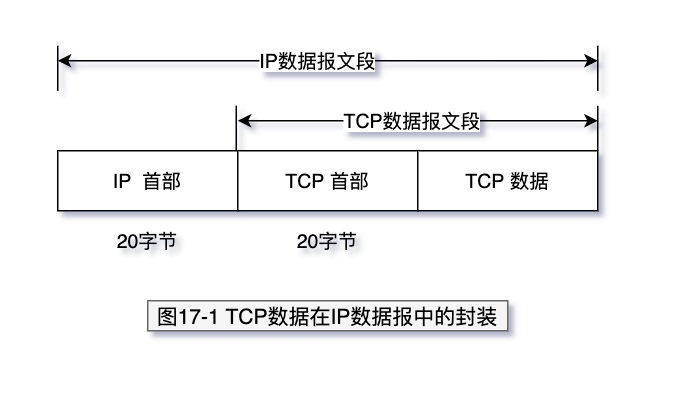

# TCP：传输控制协议

## TCP 的服务

尽管 TCP 和 UDP 都使用相同的网络层（IP），TCP 却向应用层提供与 UDP 完全不同的服务。TCP 提供一种面向连接的、可靠的字节流服务。

面向连接意味着两个使用 TCP 的应用（通常是一个客户和一个服务器）在彼此交换数据
之前必须先建立一个 TCP 连接。这一过程与打电话很相似，先拨号振铃，等待对方摘机说
“喂”，然后才说明是谁。在第 18 章我们将看到一个 TCP 连接是如何建立的，以及当一方通信
结束后如何断开连接。

在一个 TCP 连接中，仅有两方进行彼此通信。在第 12 章介绍的广播和多播不能用于 TCP。
TCP 通过下列方式来提供可靠性：

- 应用数据被分割成 TCP 认为最适合发送的数据块。这和 UDP 完全不同，应用程序产生的
  数据报长度将保持不变。由 TCP 传递给 IP 的信息单位称为报文段或段（segment）
  [参见图 1-7](./images/TCP-IP-1-7.png)。在 18 节我们将看到 TCP 如何确定报文段的长度。( 最大报文段长度`MSS`)

- 当 TCP 发出一个段后，它启动一个定时器，等待目的端确认收到这个报文段。如果不能
  及时收到一个确认，将重发这个报文段。在第 21 章我们将了解 TCP 协议中自适应的超时及重传策略。

- 当 TCP 收到发自 TCP 连接另一端的数据，它将发送一个确认。这个确认不是立即发送，通常将推迟几分之一秒，(Nagle 算法)。

- TCP 将保持它首部和数据的检验和。这是一个端到端的检验和，目的是检测数据在传输
  过程中的任何变化。如果收到段的检验和有差错，TCP 将丢弃这个报文段和不确认收到此报文段（希望发端超时并重发）。

- 既然 TCP 报文段作为 IP 数据报来传输，而 IP 数据报的到达可能会失序，因此 TCP 报文段
  的到达也可能会失序。如果必要，TCP 将对收到的数据进行重新排序，将收到的数据以正确的顺序交给应用层。

- 既然 IP 数据报会发生重复，TCP 的接收端必须丢弃重复的数据。

- TCP 还能提供流量控制。TCP 连接的每一方都有固定大小的缓冲空间。TCP 的接收端只
  允许另一端发送接收端缓冲区所能接纳的数据。这将防止较快主机致使较慢主机的缓冲区溢出。

两个应用程序通过 TCP 连接交换 8bit 字节构成的字节流。TCP 不在字节流中插入记录标识
符。我们将这称为字节流服务（bytestreamservice）。如果一方的应用程序先传 10 字节，又传
20 字节，再传 50 字节，连接的另一方将无法了解发方每次发送了多少字节。收方可以分 4 次接
收这 80 个字节，每次接收 20 字节。一端将字节流放到 TCP 连接上，同样的字节流将出现在 TCP 连接的另一端。

另外，TCP 对字节流的内容不作任何解释。TCP 不知道传输的数据字节流是二进制数据，
还是 ASCII 字符、EBCDIC 字符或者其他类型数据。对字节流的解释由 TCP 连接双方的应用层解释。

这种对字节流的处理方式与 Unix 操作系统对文件的处理方式很相似。Unix 的内核
对一个应用读或写的内容不作任何解释，而是交给应用程序处理。对 Unix 的内核来说，
它无法区分一个二进制文件与一个文本文件。

## TCP 首部

> 图 17-1 TCP 数据在 IP 数据报中的封装

> 图 17-2 TCP 包首部

每个 TCP 段都包含源端和目的端的端口号，用于寻找发端和收端应用进程。这两个值加
上 IP 首部中的源端 IP 地址和目的端 IP 地址唯一确定一个 TCP 连接。
有时，一个 IP 地址和一个端口号也称为一个插口（socket）。这个术语出现在最早的 TCP
规范（RFC793）中，后来它也作为表示伯克利版的编程接口。插口对（socketpair）
(包含客户 IP 地址、客户端口号、服务器 IP 地址和服务器端口号的四元组)可唯一确定互
联网络中每个 TCP 连接的双方。

序号用来标识从 TCP 发端向 TCP 收端发送的数据字节流，它表示在这个报文段中的的第一
个数据字节。如果将字节流看作在两个应用程序间的单向流动，则 TCP 用序号对每个字节进
行计数。序号是 32bit 的无符号数，序号到达 232－1 后又从 0 开始。

当建立一个新的连接时，SYN 标志变 1。序号字段包含由这个主机选择的该连接的初始序
号 ISN（InitialSequenceNumber）。该主机要发送数据的第一个字节序号为这个 ISN 加 1，因为
SYN 标志消耗了一个序号（将在下章详细介绍如何建立和终止连接，届时我们将看到 FIN 标志也要占用一个序号）。

既然每个传输的字节都被计数，确认序号包含发送确认的一端所期望收到的下一个序号。
因此，确认序号应当是上次已成功收到数据字节序号加 1。只有 ACK 标志（下面介绍）为 1 时确认序号字段才有效。
发送 ACK 无需任何代价，因为 32bit 的确认序号字段和 ACK 标志一样，总是 TCP 首部的一
部分。因此，我们看到一旦一个连接建立起来，这个字段总是被设置，ACK 标志也总是被设置为 1。

TCP 为应用层提供全双工服务。这意味数据能在两个方向上独立地进行传输。因此，连
接的每一端必须保持每个方向上的传输数据序号。

TCP 可以表述为一个没有选择确认或否认的滑动窗口协议（滑动窗口协议用于数据传输）。
我们说 TCP 缺少选择确认是因为 TCP 首部中的确认序号表示发方已成功收
到字节，但还不包含确认序号所指的字节。当前还无法对数据流中选定的部分进行确认。例
如，如果 1 ～ 1024 字节已经成功收到，下一报文段中包含序号从 2049 ～ 3072 的字节，收端并不
能确认这个新的报文段。它所能做的就是发回一个确认序号为 1025 的 ACK。它也无法对一个
报文段进行否认。例如，如果收到包含 1025 ～ 2048 字节的报文段，但它的检验和错，TCP 接
收端所能做的就是发回一个确认序号为 1025 的 ACK。在 21.7 节我们将看到重复的确认如何帮
助确定分组已经丢失。

首部长度给出首部中 32bit 字的数目。需要这个值是因为任选字段的长度是可变的。这个
字段占 4bit，因此 TCP 最多有 60 字节的首部。然而，没有任选字段，正常的长度是 20 字节。
在 TCP 首部中有 6 个标志比特。它们中的多个可同时被设置为 1。我们在这儿简单介绍它
们的用法，在随后的章节中有更详细的介绍。

- URG 紧急指针（urgentpointer）有效。
- ACK 确认序号有效。
- PSH 接收方应该尽快将这个报文段交给应用层。
- RST 重建连接。
- SYN 同步序号用来发起一个连接。
- FIN 发端完成发送任务。

TCP 的流量控制由连接的每一端通过声明的窗口大小来提供。窗口大小为字节数，起始
于确认序号字段指明的值，这个值是接收端正期望接收的字节。窗口大小是一个 16bit 字段，
因而窗口大小最大为 65535 字节。在 24.4 节我们将看到新的窗口刻度选项，它允许这个值按比例变化以提供更大的窗口。

检验和覆盖了整个的 TCP 报文段：TCP 首部和 TCP 数据。这是一个强制性的字段，一定是
由发端计算和存储，并由收端进行验证。TCP 检验和的计算和 UDP 检验和的计算相似，使用如 11.3 节所述的一个伪首部。

只有当 URG 标志置 1 时紧急指针才有效。紧急指针是一个正的偏移量，和序号字段中的值
相加表示紧急数据最后一个字节的序号。TCP 的紧急方式是发送端向另一端发送紧急数据的一种方式。

最常见的可选字段是最长报文大小，又称为 MSS(MaximumSegmentSize)。每个连接方
通常都在通信的第一个报文段（为建立连接而设置 SYN 标志的那个段）中指明这个选项。它
指明本端所能接收的最大长度的报文段。

从图 17-2 中我们注意到 TCP 报文段中的数据部分是可选的。一个连
接建立和一个连接终止时，双方交换的报文段仅有 TCP 首部。如果一方没有数据要发送，也
使用没有任何数据的首部来确认收到的数据。在处理超时的许多情况中，也会发送不带任何数据的报文段。
