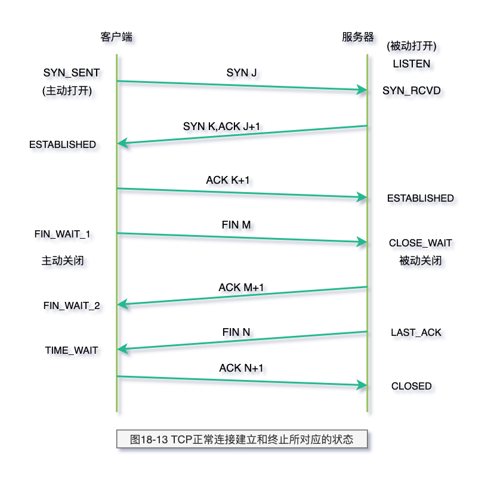
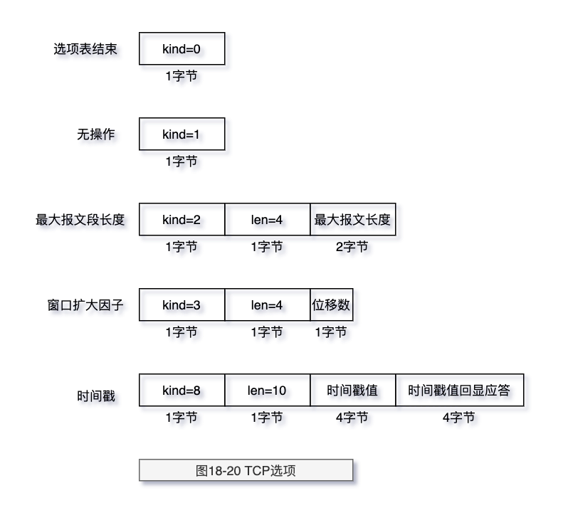

# TCP 连接的建立与终止

> 关键字：

- 建立连接协议
- TCP 的半关闭
- TCP 的状态变迁图
- 2MSL 等待状态
- FIN_WAIT_2 状态
- 同时打开
- 同时关闭
- TCP 选项
- TCP 服务器的设计
- 最大报文段长度（MSS）

## 建立连接协议

建立一条 TCP 连接

1. 请求端（通常称为客户端）发送一个 SYN 段指明客户打算连接的服务器的端口，以及初
   始序号（ISN，在这个例子中为 1415531521）。这个 SYN 段为报文段 1。
2. 服务器发回包含服务器的初始序号的 SYN 报文段（报文段 2）作为应答。同时，将确认
   序号设置为客户的 ISN 加 1 以对客户的 SYN 报文段进行确认。一个 SYN 将占用一个序号。
3. 客户必须将确认序号设置为服务器的 ISN 加 1 以对服务器的 SYN 报文段进行确认（报文段 3）。

这三个报文段完成连接的建立。这个过程也称为三次握手（three-wayhandshake）。

> 图 18-3 连接建立与终止的时间系列


## 连接终止协议

建立一个连接需要三次握手，而终止一个连接要经过 4 次握手。这由 TCP 的半关闭（half-close）造成的。
既然一个 TCP 连接是全双工（即数据在两个方向上能同时传递），因此每个方向必须单独地进行关闭。
这原则就是当一方完成它的数据发送任务后就能发送一个 FIN 来终止这个方向连接。
当一端收到一个 FIN，它必须通知应用层另一端几经终止了那个方向的数据传送。发送 FIN 通常是应用层进行关闭的结果。

收到一个 FIN 只意味着在这一方向上没有数据流动。一个 TCP 连接在收到一个 FIN 后仍能发送数据。
而这对利用半关闭的应用来说是可能的，尽管在实际应用中只有很少的 TCP 应用程序这样做。

首先进行关闭的一方（即发送第一个 FIN）将执行主动关闭，而另一方（收到这个 FIN）
执行被动关闭。通常一方完成主动关闭而另一方完成被动关闭(双方也可都执行主动关闭)。

> 图 18-4 连接终止期间报文段的正常交换


## TCP 的半关闭

TCP 提供了连接的一端在结束它的发送后还能接收来自另一端数据的能力。

为了使用这个特性，编程接口必须为应用程序提供一种方式来说明**我已经完成了数据
传送，因此发送一个文件结束（FIN）给另一端，但我还想接收另一端发来的数据，直到它给我发来文件结束（FIN）**。

图 18-10 显示了一个半关闭的典型例子。让左方的客户端开始半关闭，当然也可以由另一端开始。开始的两个报文段和
图 18-4 是相同的：初始端发出的 FIN，接着是另一端对这个 FIN 的 ACK 报文段。但后面就和图 18-4 不同，因为接收半关闭的一方仍能发送数据。
我们只显示一个数据报文段和一个 ACK 报文段，但可能发送了许多数据报文段（将在第 19 章讨论数据报文段和确认报文段的交换）。
当收到半关闭的一端在完成它的数据传送后，将发送一个 FIN 关闭这个方向的连接，这将传送一个文件结束符给发起这个半关闭的应用进程。
当对第二个 FIN 进行确认后，这个连接便彻底关闭了。

> 图 18-10 TCP 半关闭的例子


## TCP 的状态变迁图

> 图 18-12 TCP 的状态变迁图


> 图 18-13 TCP 正常连接建立和终止所对应的状态



- 2MSL 等待状态

TIMEWAIT 状态也称为 2MSL 等待状态。每个具体 TCP 实现必须选择一个报文段最大生
存时间 MSL（MaximumSegmentLifetime）。它是任何报文段被丢弃前在网络内的最长时间。
我们知道这个时间是有限的，因为 TCP 报文段以 IP 数据报在网络内传输，而 IP 数据报则有限制
其生存时间的 TTL 字段。

这种 2MSL 等待的另一个结果是这个 TCP 连接在 2MSL 等待期间，定义这个连接的插口
（客户的 IP 地址和端口号，服务器的 IP 地址和端口号）不能再被使用。这个连接只能在 2MSL
结束后才能再被使用。

在连接处于 2MSL 等待时，任何迟到的报文段将被丢弃。因为处于 2MSL 等待的、由该插
口对(socketpair)定义的连接在这段时间内不能被再用，因此当要建立一个有效的连接时，来
自该连接的一个较早替身（incarnation）的迟到报文段作为新连接的一部分不可能不被曲解
（一个连接由一个插口对来定义。一个连接的新的实例（instance）称为该连接的替身）。

- FIN_WAIT_2 状态

在 FINWAIT2 状态我们已经发出了 FIN，并且另一端也已对它进行确认。除非我们在实
行半关闭，否则将等待另一端的应用层意识到它已收到一个文件结束符说明，并向我们发一
个 FIN 来关闭另一方向的连接。只有当另一端的进程完成这个关闭，我们这端才会从
FINWAIT2 状态进入 TIMEWAIT 状态。
这意味着我们这端可能永远保持这个状态。另一端也将处于 CLOSEWAIT 状态，并一直
保持这个状态直到应用层决定进行关闭。

## 同时打开

两个应用程序同时彼此执行主动打开的情况是可能的，尽管发生的可能性极小。每一方
必须发送一个 SYN，且这些 SYN 必须传递给对方。这需要每一方使用一个对方熟知的端口作
为本地端口。这又称为同时打开（simultaneousopen）。

## 同时关闭

我们在以前讨论过一方（通常但不总是客户方）发送第一个 FIN 执行主动关闭。双方都执
行主动关闭也是可能的，TCP 协议也允许这样的同时关闭（simultaneousclose）。

## TCP 选项



TCP 选项：

```log
<mss512,nop,wscale0,nop,nop,timestamp1466470>
```

MSS 选项设置为 512，后面是 NOP，接着是窗口扩大选项。第一个 NOP 用来将窗口扩大选项填
充为 4 字节的边界。同样，10 字节的时间戳选项放在两个 NOP 后，占 12 字节，同时使两个 4 字
节的时间戳满足 4 字节边界。

## TCP 服务器的设计

大多数的 TCP 服务器进程是并发的。当一个新的连接请求到达服务器时，
服务器接受这个请求，并调用一个新进程来处理这个新的客户请求。不同的操作系统使用不
同的技术来调用新的服务器进程。在 Unix 系统下，常用的技术是使用 fork 函数来创建新的进
程。如果系统支持，也可使用轻型进程，即线程（thread）。

- TCP 服务器端口号

这个例子再次重申 TCP 使用由本地地址和远端地址组成的 4 元组：目的 IP 地址、目的端口
号、源 IP 地址和源端口号来处理传入的多个连接请求。TCP 仅通过目的端口号无法确定那个
进程接收了一个连接请求。另外，在三个使用端口 23 的进程中，只有处于 LISTEN 的进程能够
接收新的连接请求。处于 ESTABLISHED 的进程将不能接收 SYN 报文段，而处于 LISTEN 的进
程将不能接收数据报文段。

- 限定的本地 IP 地址
- 限定的远端 IP 地址
- 呼入连接请求队列

一个并发服务器调用一个新的进程来处理每个客户请求，因此处于被动连接请求的服务
器应该始终准备处理下一个呼入的连接请求。那正是使用并发服务器的根本原因

但仍有可能出现当服务器在创建一个新的进程时，或操作系统正忙于处理优先级更高的进程时，到达
多个连接请求。当服务器正处于忙时，TCP 是如何处理这些呼入的连接请求？
在伯克利的 TCP 实现中采用以下规则：

1. 正等待连接请求的一端有一个固定长度的连接队列，该队列中的连接已被 TCP 接受（即三次握手已经完成），但还没有被应用层所接受。
   注意区分 TCP 接受一个连接是将其放入这个队列，而应用层接受连接是将其从该队列中移出。

2. 应用层将指明该队列的最大长度，这个值通常称为积压值(backlog)。它的取值范围是 0~5 之间的整数，
   包括 0 和 5（大多数的应用程序都将这个值说明为 5）。

3. 当一个连接请求（即 SYN）到达时，TCP 使用一个算法，根据当前连接队列中的连接数
   来确定是否接收这个连接。我们期望应用层说明的积压值为这一端点所能允许接受连接
   的最大数目，但情况不是那么简单。注意，积压值说明的是 TCP 监听的端点已
   被 TCP 接受而`等待应用层接受`的最大连接数。这个积压值对系统所允许的最大连接数，
   或者并发服务器所能并发处理的客户数，并无影响。

## 最大报文段长度（MSS）

最大报文段长度（MSS）表示 TCP 传往另一端的最大块数据的长度。当一个连接建立时，
连接的双方都要通告各自的 MSS。我们已经见过 MSS 都是 1024。这导致 IP 数据报通常是 40 字
节长：20 字节的 TCP 首部和 20 字节的 IP 首部。
在有些书中，将它看作可“协商”选项。它并不是任何条件下都可协商。当建立一个连
接时，每一方都有用于通告它期望接收的 MSS 选项（MSS 选项只能出现在 SYN 报文段中）。如
果一方不接收来自另一方的 MSS 值，则 MSS 就定为默认值 536 字节（这个默认值允许 20 字节的
IP 首部和 20 字节的 TCP 首部以适合 576 字节 IP 数据报)。
