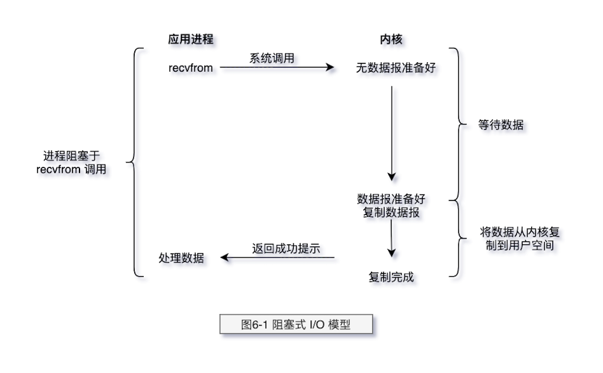
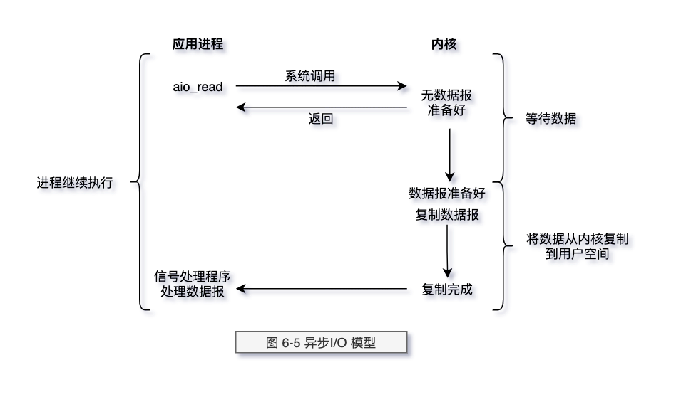
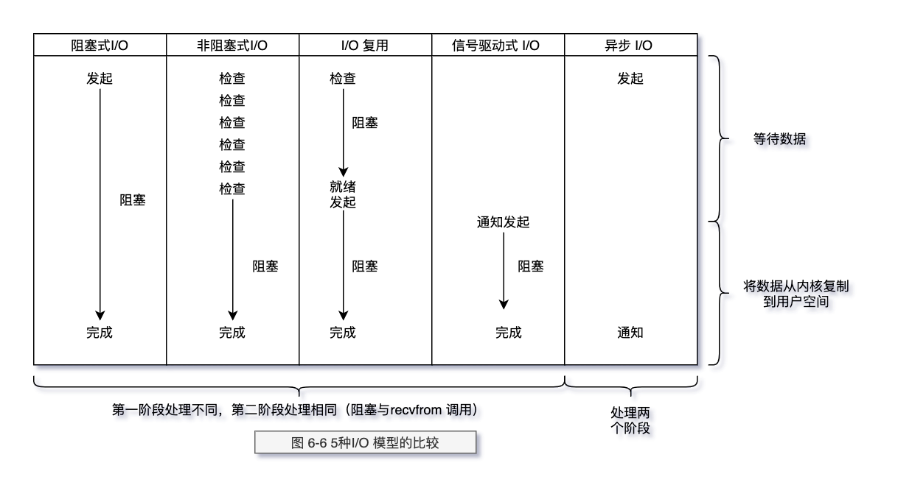

# I/O 复用 select 和 poll 函数

关键字：

- 阻塞式 I/O;
- 非阻塞式 I/O;
- I/O 复用(selec 和 poll)
- 信号驱动式 I/O( SIGIO);
- 异步 I/O(POSX 的 aio\_系列函数)。
- I/O 模型对比
- 同步 I/O 操作
- 异步 I/O 操作
- select 函数

## 概述

在 5.12 节中,我们看到 TCP 客户同时处理两个输入:标准输入和 TCP 套接字。我们遇到的问
题是就在客户阻塞于(标准输入上的) fgets 调用期间,服务器进程会被杀死。服务器 TCP 虽然
正确地给客户 TCP 发送了一个 FIN,但是既然客户进程正阻塞于从标准输入读入的过程,它将看
不到这个 EOF,直到从套接字读时为止(可能已过了很长时间)。

这样的进程需要一种预先告知内核的能力,使得内核一旦发现进程指定的一个或多个 ⅣO 条件就绪(也就是说输入已准备好被
读取,或者描述符已能承接更多的输出),它就通知进程。这个能力称为 IO 复用(IOmultiplexing),
是由 select 和 po11 这两个函数支持的。我们还介绍前者较新的称为 select 的 POSIX 变种。

## 5 种 I/O 模型:

在介绍 selec 和 po1 这两个函数之前,我们需要回顾整体,查看 Unⅸ 下可用的 5 种 I/O 模型的基本区别:

- 阻塞式 I/O;
- 非阻塞式 I/O;
- I/O 复用(selec 和 poll)
- 信号驱动式 I/O( SIGIO);
- 异步 I/O(POSX 的 aio\_系列函数)。

正如我们将在本节给出的所有例子所示,一个输入操作通常包括两个不同的阶段
(1)等待数据准备好;
(2)从内核向进程复制数据。

对于一个套接字上的输入操作,
第一步通常涉及等待数据从网络中到达。当所等待分组到达时,它被复制到内核中的某个缓冲区。
第二步就是把数据从内核缓冲区复制到应用进程缓冲区。

## recvfrom 函数

在本节的例子中,我们把 recvfrom 函数视为系统调用,因为我们正在区分应用进程和内核。
不论它如何实现一般都会从在应用进程空间中运行切换到在内核空间中运行,一段时间之后再切换回来。

进程调用 recvfrom,其系统调用直到数据报到达且被复制到应用进程的缓冲
区中或者发生错误才返回。最常见的错误是系统调用被信号中断。
我们说进程在从调用 recvfrom 开始到它返回的整段时间内是被阻塞的。recvfrom 成功返回后,应用进程开始处理数据报。

## 阻塞式 I/O 模型

> 图 6-1 阻塞式 I/O 模型



从**等待数据准备好** -> **将从内核复制到用户空间**都是阻塞的。

## 非阻塞式 I/O 模型

进程把一个套接字**设置成非阻塞**是在通知内核:当所请求的 IO 操作非得把本进程投入睡眠
才能完成时,不要把本进程投入睡眠,而是返回一个错误。

前三次调用 recvfrom 时没有数据可返回,因此内核转而立即返回一个 EWOULDBLOCK 错误。
第四次调用 recvfrom 时已有一个数据报准备好,它被复制到应用进程缓冲区,于是 recvfrom
成功返回。我们接着处理数据。
当一个应用进程像这样对一个非阻塞描述符循环调用 recvfrom 时,我们称之为轮询
polling)。应用进程持续轮询内核,以査看某个操作是否就绪。这么做往往耗费大量 CPU 时间
不过这种模型偶尔也会遇到,通常是在专门提供某一种功能的系统中才有。

> 图 6-2 非阻塞式 I/O 模型


## I/O 复用模型

有了 I/O 复用( I/O multiplexing),我们就可以调用 select 或 poll,阻塞在这两个系统调用
中的某一个之上,而不是阻塞在真正的 I/O 系统调用上。图 6-3 概括展示了 I/O 复用模型。

> 图 6-3 I/O 复用模型


我们阻塞于 select 调用,等待数据报套接字变为可读。当 select 返回套接字可读这一条件
时,我们调用 recvfrom 把所读数据报复制到应用进程缓冲区。

比较图 6-3 和图 6-1,I/O 复用并不显得有什么优势,事实上由于使用 select 需要两个而不是单个系统调用,I/O 复用还稍有劣势。
不过我们将在本章稍后看到,使用 select 的优势在于我们可以等待多个描述符就绪。

```txt
与I/O复用密切相关的另一种I/O模型是在多线程中使用阻塞式I/O.这种模型与上述模型
极为相似,但它没有使用 select阻塞在多个文件描述符上,而是使用多个线程(每个文件
描述符一个线程),这样每个线程都可以自由地调用诸如 recvfrom之类的阻塞式I/O系统调用了。
```

## 信号驱动式 I/O 模型

我们也可以用信号,让内核在描述符就绪时发送 SIGIO 信号通知我们。我们称这种模型为
信号驱动式 I/O( signal-driven1o),图 6-4 是它的概要展示

> 图 6-4 信号驱动式 I/O 模型


我们首先开启套接字的信号驱动式 IO 功能(我们将在 252 节讲解这个过程),并通过
sigaction 系统调用安装一个信号处理函数。该系统调用将立即返回,我们的进程继续工作,
也就是说它没有被阻塞。当数据报准备好读取时,内核就为该进程产生一个 SIGIO 信号。我们
随后既可以在信号处理函数中调用 recvfrom 读取数据报,并通知主循环数据已准备好待处理
(这正是我们将在 253 节中所要做的事情),也可以立即通知主循环,让它读取数据报。

无论如何处理 SIGIO 信号,这种模型的优势在于等待数据报到达期间进程不被阻塞。主循
环可以继续执行,只要等待来自信号处理函数的通知:既可以是数据已准备好被处理,也可以
是数据报已准备好被读取。

## 异步 I/O 模型

异步 I/O( asynchronous I/O)由 POSX 规范定义。演变成当前 POSX 规范的各种早期标准所定义的实时函数中存在的差异已经取得一致。

一般地说,这些函数的工作机制是:告知内核启动某个操作,并让内核在整个操作(包括将数据从内核复制到我们自己的缓冲区)完成后通知我们。
这种模型与前一节介绍的信号驱动模型的主要区别在于:信号驱动式 IO 是由内核通知我们何时可以启动一个 I/O 操作,而异步 I/O 模型是由内核通知我们 I/O 操作何时完成。
图 6-5 给出了个例子。

> 图 6-5 异步 I/O 模型



我们调用 aio_read 函数(POSX 异步 I/O 函数以 aio\_或 lio 开头),给内核传递描述符、缓
冲区指针、缓冲区大小(与 read 相同的三个参数)和文件偏移(与 lseek 类似),并告诉内核当
整个操作完成时如何通知我们。该系统调用立即返回,而且在等待 I/O 完成期间,我们的进程不
被阻塞。本例子中我们假设要求内核在操作完成时产生某个信号。该信号直到数据已复制到应
用进程缓冲区才产生,这一点不同于信号驱动式 O 模型。

```txt
本书编写至此的时候,支持 POSⅨ 异步 I/O 模型的系统仍较罕见。我们不能确定这样的系
统是否支持套接字上的这种模型。这儿我们只是用它作为一个与信号驱动式 I/O 模型相比照的例子。
```

## I/O 模型对比

图 6-6 对比了上述 5 种不同的 I/O 模型。可以看出,前 4 种模型的主要区别在于第一阶段,因
为它们的第二阶段是一样的:在数据从内核复制到调用者的缓冲区期间,进程阻塞于 recvfrom 调用。
相反,异步 IO 模型在这两个阶段都要处理,从而不同于其他 4 种模型。

> 图 6-6 5 种 I/O 模型的比较



POSIX 把这两个术语定义如下:

- 同步 I/O 操作( synchronous I/O opetation)导致请求进程阻塞,直到 I/O 操作完成;
- 异步 I/O 操作( asynchronous I/O opetation)不导致请求进程阻塞。

根据上述定义,我们的前 4 种模型——`阻塞式 I/O 模型`、`非阻塞式 I/O 模型`、`I/O 复用模型`和`信号驱动式 I/O 模型`都是同步 I/O 模型,
因为其中真正的 I/O 操作( recvfrom)将阻塞进程。只有`异步 I/O 模型`与 POSIX 定义的异步 I/O 相匹配。

## select 函数

```c
#include <sys/select.h>
#include <sys/time.h>

//返回值：就绪描述字的总数目，0——超时，-1——出错
int select(int maxfdpl, fd_set *readset, fd_set *writeset,fd_set *exceptset, const struct timeval *timeout);

struct timeval {
               time_t      tv_sec;         /* seconds */
               suseconds_t tv_usec;        /* microseconds */
};
```

## Links

- [高级 I/O 之 I/O 多路转接——pool、select](https://www.cnblogs.com/nufangrensheng/p/3557584.html)
